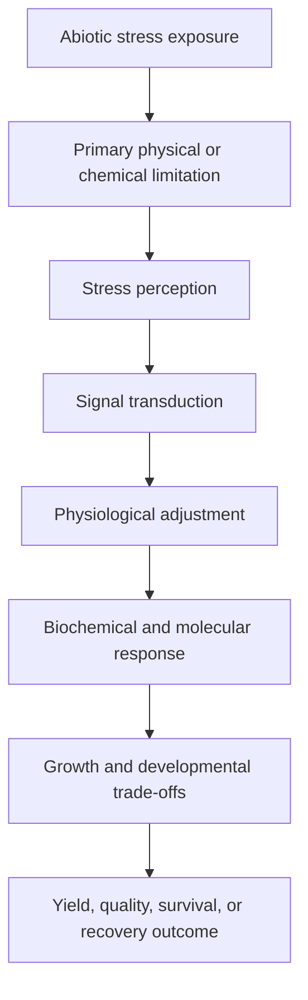
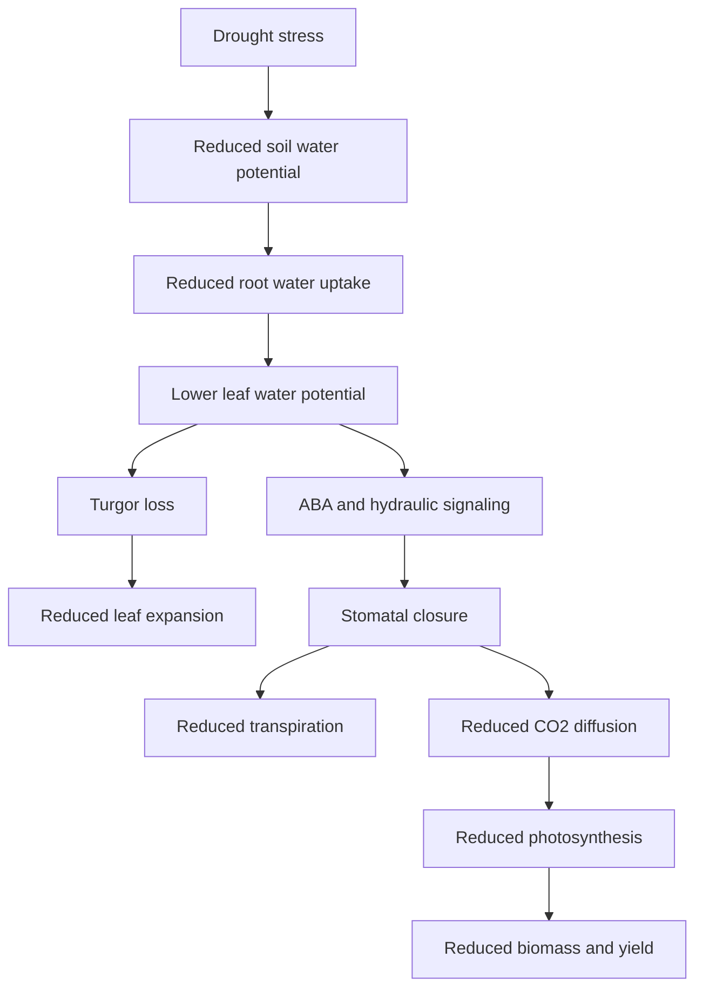
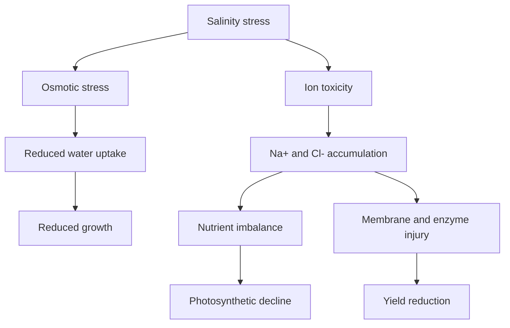
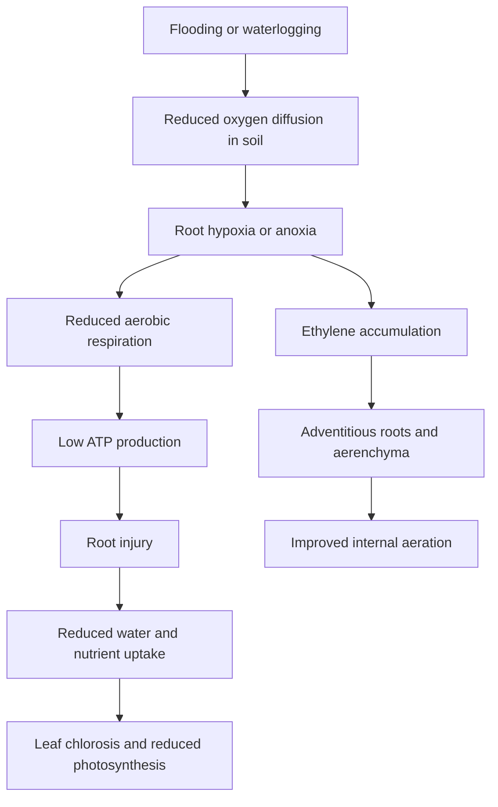

# How to Add Visuals, Photos, and Infographics

This repository uses original diagrams, open-license images, and user-generated figures to explain plant stress physiology.

## Visual policy

Use:

- Original diagrams created with Mermaid
- Photos taken by the repository author
- Open-license images with attribution
- Original infographics created in Canva, PowerPoint, BioRender, R, Python, or Mermaid
- Figures generated from simulated, published, or permission-approved datasets

Avoid:

- Copyrighted textbook figures
- Screenshots from books
- Publisher-owned diagrams
- Unpublished collaborator data without permission
- Figures copied from journal articles unless the license clearly allows reuse

---

# Folder structure for visuals

```text
assets/
├── photos/
│   ├── drought-symptom-example.jpg
│   ├── salinity-leaf-burn-example.jpg
│   ├── flooding-root-damage-example.jpg
│   └── heat-stress-flower-injury-example.jpg
├── figures/
│   ├── drought-trait-summary.png
│   ├── salinity-ion-homeostasis.png
│   └── heat-reproductive-stress.png
├── infographics/
│   ├── stress-response-framework.png
│   ├── drought-mechanism-summary.png
│   └── combined-stress-network.png
└── original-diagrams/
    ├── drought-response-flow.md
    ├── salinity-response-flow.md
    ├── flooding-response-flow.md
    └── ros-signaling-network.md
```

---

# How to insert an image in Markdown

Use this format:

```markdown

```

Example:

```markdown

```

---

# How to insert a figure with caption

```markdown
<p align="center">
  
</p>

<p align="center">
  <b>Figure 1.</b> Conceptual summary of drought stress effects on water status, stomatal regulation, photosynthesis, and yield.
</p>
```

---

# How to insert an infographic

```markdown
<p align="center">
  
</p>

<p align="center">
  <b>Infographic.</b> General framework connecting abiotic stress exposure with physiological response and crop performance.
</p>
```

---

# How to create original diagrams using Mermaid

Mermaid diagrams are useful because they are text-based, editable, and GitHub can render them directly.

## Example: General abiotic stress response



## Example: Drought response



## Example: Salinity response



## Example: Flooding response



---

# Recommended visual types for each stress

| Stress | Useful photos | Useful diagrams | Useful infographics |
|---|---|---|---|
| Drought | Wilting, leaf rolling, dry soil, canopy temperature | Soil-water-root-shoot pathway | Drought traits and interpretation |
| Salinity | Leaf burn, chlorosis, salt crust | Osmotic phase vs ionic phase | Na/K balance and ion homeostasis |
| Heat | Flower abortion, leaf scorch, pollen damage | Heat sensing and HSP response | Heat impact on reproduction |
| Flooding | Saturated soil, root browning, adventitious roots | Hypoxia to ethylene response | Flooding adaptation traits |
| Chilling/freezing | Seedling injury, chlorosis, necrosis | Membrane rigidification and photoinhibition | Cold acclimation pathway |
| Light/oxidative | Sunscald, chlorosis, photobleaching | Excess light to ROS | Chlorophyll fluorescence interpretation |
| Nutrient stress | Deficiency symptoms | Nutrient uptake and remobilization | Tissue nutrient interpretation |
| Heavy metals | Root inhibition, chlorosis | Metal uptake and sequestration | Chelation and ROS defense |
| Combined stress | Heat+drought symptoms | Stress crosstalk network | Multitrait stress screening |

---

# Image naming rule

Use simple lowercase names with hyphens.

Good:

```text
drought-wilting-tomato.jpg
salinity-leaf-burn-lettuce.jpg
flooding-adventitious-roots-corn.jpg
heat-pollen-viability-soybean.png
```

Avoid:

```text
IMG_1234.JPG
Screenshot (2).png
My figure final final.png
```

---

# Attribution format for open-license images

If using an open-license image, add credit below the image:

```markdown
Image credit: Author name, source, license.
```

Example:

```markdown
Image credit: USDA-ARS, public domain.
```

---

# Best practice

Each stress-specific file should contain:

1. Mechanism diagram
2. Symptom photo
3. Trait table
4. Instrument table
5. Interpretation flowchart
6. Research-use summary table
7. Key references
