# Drought Stress Physiology: Advanced Research Guide

## Purpose

This file is an advanced, research-oriented guide to drought stress physiology. It is designed for plant physiologists, horticultural scientists, crop scientists, breeders, graduate students, postdoctoral researchers, and anyone studying crop performance under water-limited environments.

The goal is to connect drought stress from **soil water limitation** to **root water uptake**, **hydraulic signaling**, **ABA-mediated stomatal regulation**, **photosynthetic limitation**, **oxidative stress**, **osmotic adjustment**, **root architecture**, **reproductive sensitivity**, **yield stability**, and **recovery after rewatering**.

This guide is written as an original scientific synthesis and should be expanded with original diagrams, open-license images, your own photos, and properly cited research literature.

---

# 1. Conceptual Definition

<p align="center">
  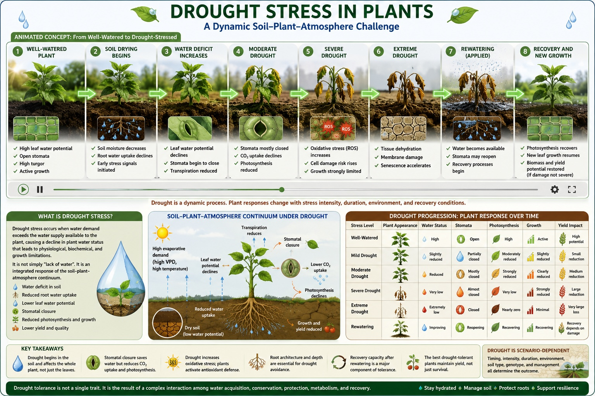
</p>

<p align="center">
  <b>Concept image.</b> A healthy plant maintains water uptake, turgor, transpiration, and photosynthesis, whereas a drought-stressed plant experiences declining water status, stomatal closure, reduced carbon gain, and growth limitation.
</p>

> **Image note:** Upload your own photo or open-license image as  
> `assets/photos/healthy-vs-drought-plant.jpg`.  
> If you do not have an image yet, keep this placeholder and add the image later.

---

## What is drought stress?

Drought stress occurs when the water available to the plant is not enough to meet the water required for normal growth, metabolism, cooling, photosynthesis, and reproduction.

In simple terms:

```text
The soil cannot supply water fast enough
        ↓
The roots cannot absorb enough water
        ↓
The leaves begin to lose water status
        ↓
The plant closes stomata to save water
        ↓
Photosynthesis declines
        ↓
Growth, yield, and quality are reduced
```

Scientifically, drought is a **soil–plant–atmosphere continuum problem**. It begins with limited water availability in the root zone, but the final plant response depends on soil water potential, root architecture, xylem transport, leaf water potential, stomatal regulation, atmospheric demand, vapor pressure deficit, crop stage, genotype, and recovery capacity.

---

## Animated-style conceptual flow

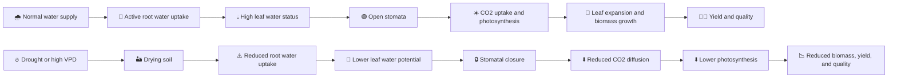

---

## Healthy plant versus drought-stressed plant

| Plant condition | Water status | Stomata | Photosynthesis | Growth | Yield implication |
|---|---|---|---|---|---|
| Well-watered plant | High leaf water potential and turgor | Mostly open | High carbon assimilation | Active leaf and root growth | Higher yield potential |
| Mild drought | Slight decline in water status | Partially closed | Moderately reduced | Leaf expansion slows | Yield may recover if stress is short |
| Moderate drought | Lower leaf water potential | Strongly regulated or closed | Strongly reduced | Biomass accumulation declines | Yield risk increases |
| Severe drought | Loss of turgor and possible tissue injury | Mostly closed | Severely limited | Senescence and injury may occur | Major yield and quality loss |
| Rewatered plant | Recovery depends on injury level | May reopen | May recover partially or fully | New growth may resume | Recovery depends on timing and crop stage |

---

## Drought is not one single stress

Drought can appear in different forms:

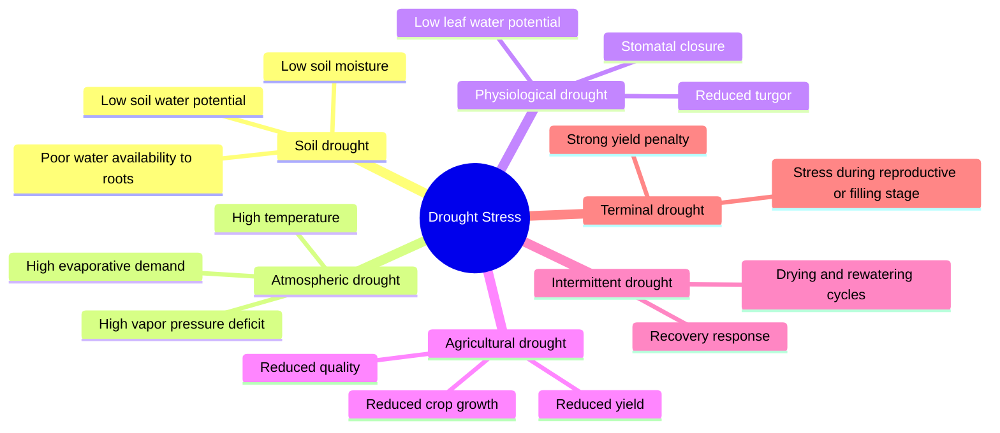

---

## Visual analogy

Drought stress can be imagined as a plant trying to maintain a water pipeline:

```text
Soil water reservoir → Roots → Xylem pipeline → Leaves → Atmosphere
```

When soil dries, the reservoir becomes harder to access. Roots must work harder to absorb water. The xylem delivers less water to the canopy. Leaves begin to lose turgor. Stomata close to reduce water loss. This protects the plant from dehydration but also restricts CO2 uptake, which reduces photosynthesis and growth.

---

## Scientific definition for research use

For research purposes, drought stress can be defined as:

> A water-limiting condition in which soil water availability and/or atmospheric demand reduce plant water status sufficiently to alter turgor-driven growth, stomatal conductance, photosynthetic carbon assimilation, metabolic homeostasis, reproductive development, yield formation, or post-stress recovery.

This definition is useful because it includes both **stress exposure** and **plant response**.

---

## Key message

Drought tolerance is not a single trait. It is an integrated outcome of:

- Water acquisition by roots
- Water conservation by stomata
- Hydraulic safety
- Osmotic adjustment
- Photosynthetic stability
- Antioxidant protection
- Reproductive resilience
- Yield stability
- Recovery after rewatering

A plant is not truly drought tolerant just because it survives. For crop research, a drought-tolerant plant should maintain useful physiological function, recover effectively, and reduce yield or quality loss under a defined drought scenario.
# 2. Drought vs. Water Deficit vs. High VPD

These terms are related but not identical.

| Term | Meaning | Research importance |
|---|---|---|
| Drought | Environmental or agronomic water shortage | Often field-scale and weather-driven |
| Water deficit | Plant or experimental water limitation | Often controlled in pots, greenhouse, or irrigation trials |
| Soil drying | Reduction in soil water content or soil water potential | Determines root water availability |
| Atmospheric drought | High evaporative demand, often high VPD | Can induce stress even when soil moisture is moderate |
| Physiological drought | Plant tissues experience low water status | Detected through leaf water potential, RWC, stomata, and canopy temperature |
| Terminal drought | Water deficit occurring late in the crop cycle | Important for grain/seed/fruit filling |
| Intermittent drought | Cycles of drying and rewatering | Useful for recovery and resilience studies |

---

# 3. Drought Stress as a Soil–Plant–Atmosphere Continuum Problem

Water moves from soil to root, root to xylem, xylem to leaf, leaf to atmosphere.

Under drought, limitation can arise at any point in this continuum.

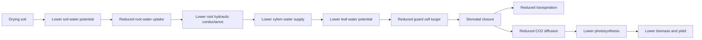

## Interpretation

A drought-tolerant crop may avoid severe tissue dehydration by:

- Maintaining deeper roots
- Maintaining hydraulic conductance
- Reducing water loss
- Closing stomata at the right time
- Maintaining photosynthesis under moderate stress
- Recovering quickly after rewatering

---

# 4. Primary Physiological Limitation

The most central limitation under drought is declining plant water status.

```text
Reduced soil water availability
        ↓
Reduced root water uptake
        ↓
Lower plant water potential
        ↓
Loss of cell turgor
        ↓
Reduced cell expansion
        ↓
Reduced leaf area and canopy development
        ↓
Lower light interception
        ↓
Reduced biomass and yield potential
```

The earliest drought response is often reduced expansion growth rather than immediate death or tissue injury. Leaf expansion, internode elongation, and canopy development are highly sensitive to declining turgor.

---

# 5. Whole-Plant Drought Response Overview

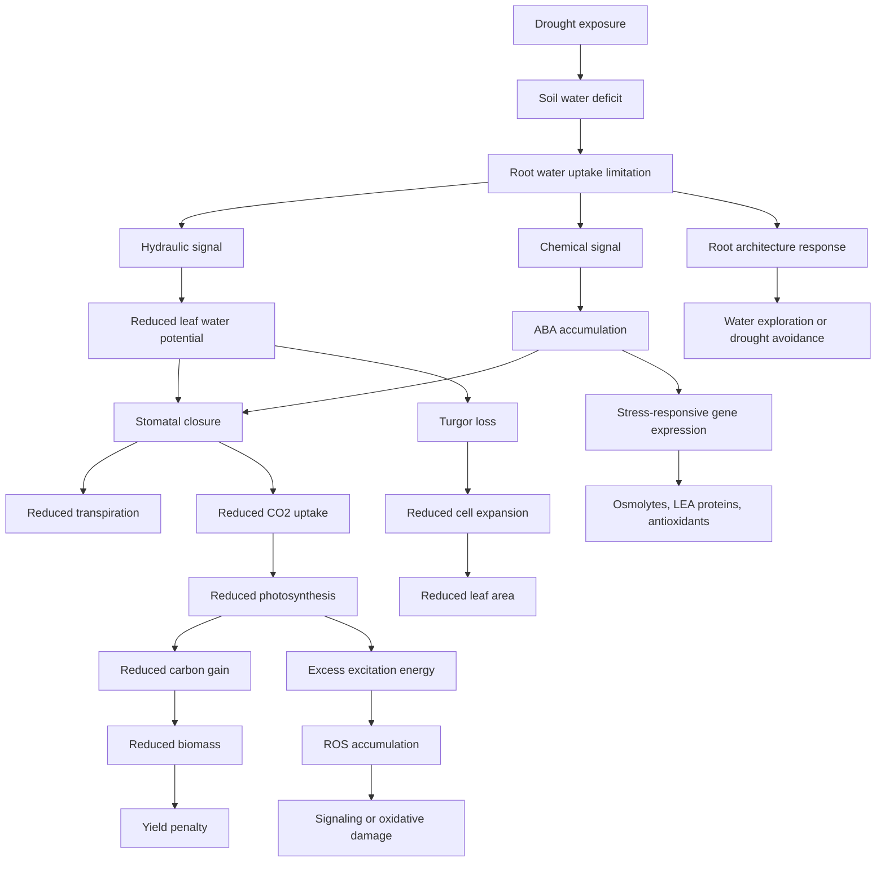

---

# 6. Drought Stress Phases

Drought should be interpreted by phase.

| Phase | Main process | Typical traits |
|---|---|---|
| Early drought | Growth reduction and stomatal regulation | Leaf expansion, gsw, canopy temperature |
| Moderate drought | Carbon assimilation limitation | A, E, Ci, WUE, chlorophyll fluorescence |
| Severe drought | Metabolic and oxidative injury | Fv/Fm, MDA, electrolyte leakage, senescence |
| Rewatering | Recovery or irreversible damage | Photosynthetic recovery, root regrowth, biomass recovery |
| Final yield stage | Agronomic consequence | Yield, harvest index, quality, seed/fruit traits |

---

# 7. Mechanism 1: Turgor Limitation and Growth Suppression

Cell expansion requires turgor. As water availability declines, plants reduce expansion growth to conserve water and maintain survival.

## Key biological logic

Drought often reduces leaf area before severely damaging photosynthetic machinery. This means early drought effects may appear as reduced canopy size, shorter internodes, smaller leaves, and reduced fresh weight.

## Mechanism diagram

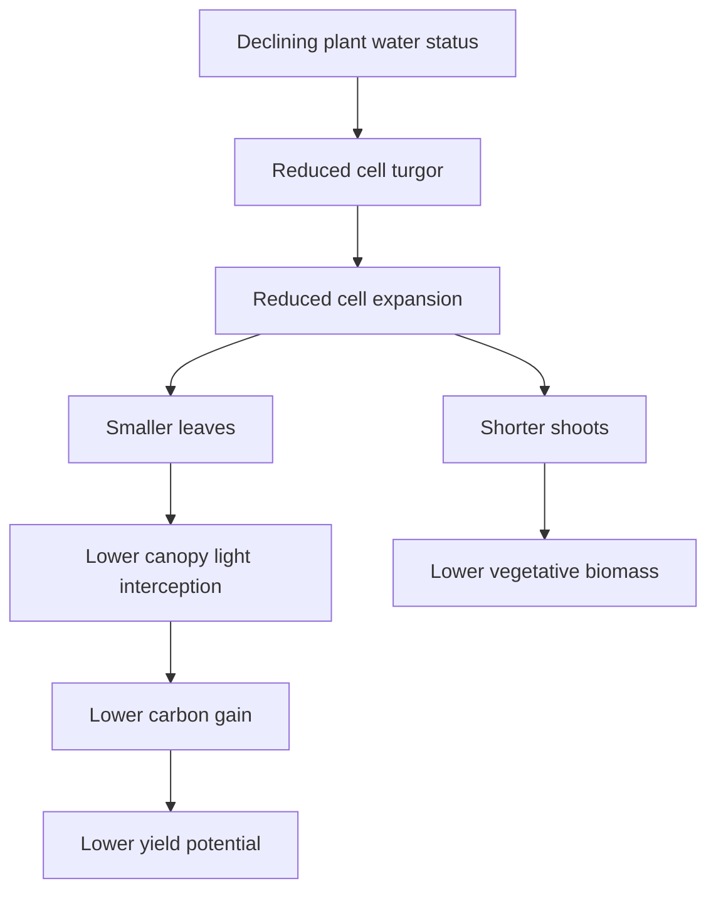

## Traits to measure

| Trait | Why it matters |
|---|---|
| Leaf area | Direct indicator of canopy expansion |
| Plant height | Shoot elongation response |
| Internode length | Growth sensitivity |
| Fresh weight | Water-associated biomass |
| Dry weight | Structural biomass |
| Relative growth rate | Growth reduction over time |
| Root/shoot ratio | Allocation shift under drought |

## Interpretation

Reduced growth is not always a failure. It can be a survival strategy. However, in crops, excessive growth reduction can reduce yield potential. Therefore, drought tolerance must balance **survival** and **productivity**.

---

# 8. Mechanism 2: Stomatal Regulation

Stomata regulate the trade-off between water conservation and carbon gain.

## Core concept

Under drought, stomata close to reduce transpiration, but this reduces CO2 entry into the leaf. The plant conserves water at the cost of photosynthesis.

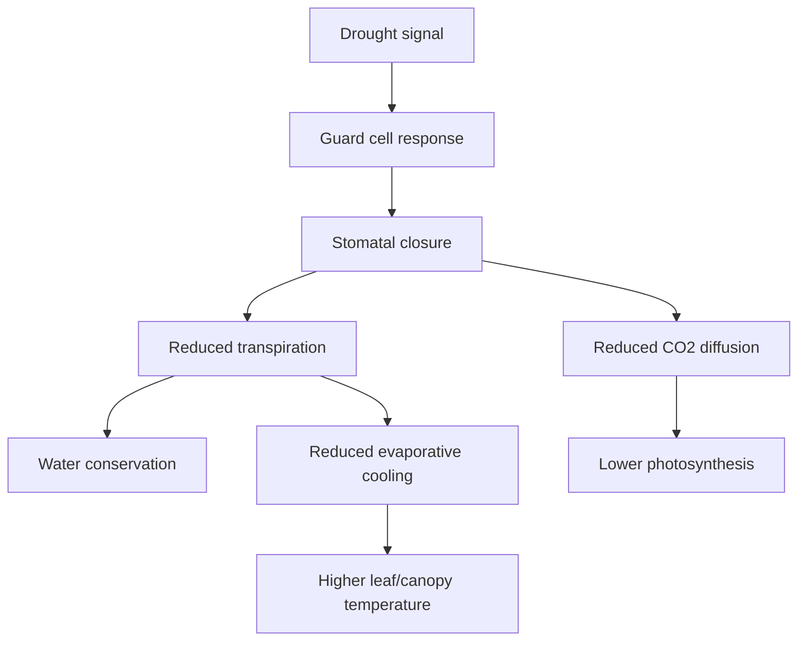

## Traits

| Trait | Interpretation |
|---|---|
| gsw | Degree of stomatal opening |
| E | Leaf water loss |
| A or Pn | Carbon assimilation |
| Ci | CO2 balance inside the leaf |
| A/gsw | Intrinsic water-use efficiency |
| Canopy temperature | Transpirational cooling status |

## Scientific interpretation

Strong stomatal closure is not automatically drought tolerance. It may conserve water but reduce carbon gain. A useful genotype closes stomata enough to protect water status but maintains enough gas exchange to support biomass or yield.

---

# 9. Mechanism 3: ABA and Hydraulic Signaling

Drought induces both hydraulic and chemical signaling.

## ABA-centered model

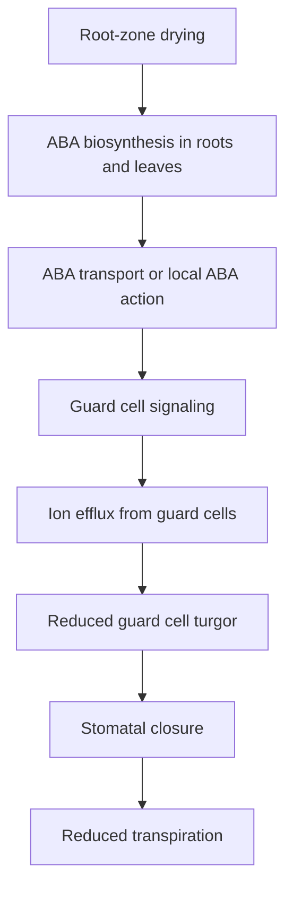

## Hydraulic signaling model

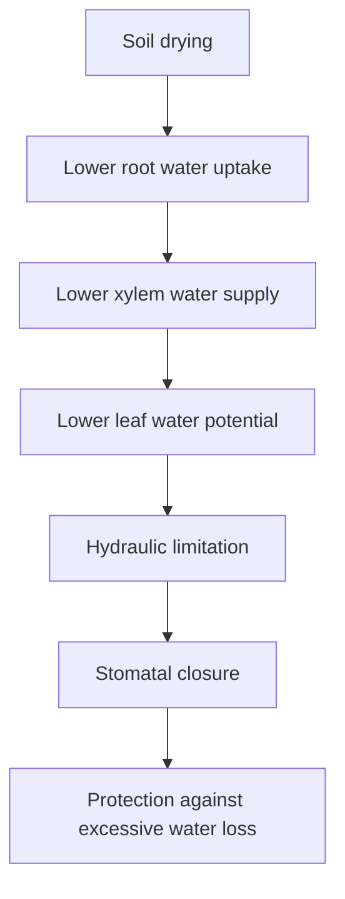

## Interpretation

ABA and hydraulics work together. ABA is important, but not the whole story. Stomata can respond to rapid changes in leaf water status, VPD, and hydraulic conductance. For this reason, drought studies should measure both **hormonal signals** and **water status traits** when possible.

---

# 10. Mechanism 4: Photosynthetic Limitation

Drought reduces photosynthesis through stomatal and non-stomatal limitations.

## Stomatal limitation

- Stomata close.
- CO2 diffusion declines.
- Ci may decrease.
- Photosynthesis declines due to reduced CO2 supply.

## Non-stomatal limitation

With stronger or prolonged drought, limitations can occur inside the photosynthetic apparatus.

Possible non-stomatal causes:

- Reduced mesophyll conductance
- Reduced Rubisco activity
- Rubisco activase sensitivity
- Impaired electron transport
- Reduced ATP/NADPH use
- Chlorophyll degradation
- Photoinhibition
- Sink limitation
- Accelerated senescence

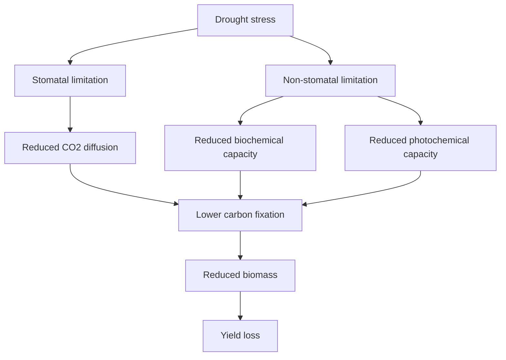

## Gas exchange traits

| Trait | Interpretation |
|---|---|
| A or Pn | Net photosynthetic carbon assimilation |
| gsw | Stomatal limitation |
| E | Transpiration |
| Ci | Balance of CO2 supply and biochemical demand |
| A/Ci curve | Biochemical capacity |
| Vcmax | Rubisco carboxylation capacity |
| Jmax | Electron transport capacity |
| WUE | Carbon gain relative to water loss |

## Chlorophyll fluorescence traits

| Trait | Interpretation |
|---|---|
| Fv/Fm | Maximum PSII efficiency |
| ΦPSII | Operating efficiency of PSII |
| ETR | Electron transport rate |
| NPQ | Thermal dissipation of excess energy |
| qP | Photochemical quenching |
| Fo/Fm changes | Photochemical or structural stress |

---

# 11. Mechanism 5: ROS, Oxidative Stress, and Antioxidant Defense

Drought can increase ROS because carbon fixation declines while light absorption may continue. This creates excess excitation pressure in chloroplasts and metabolic imbalance in mitochondria and peroxisomes.

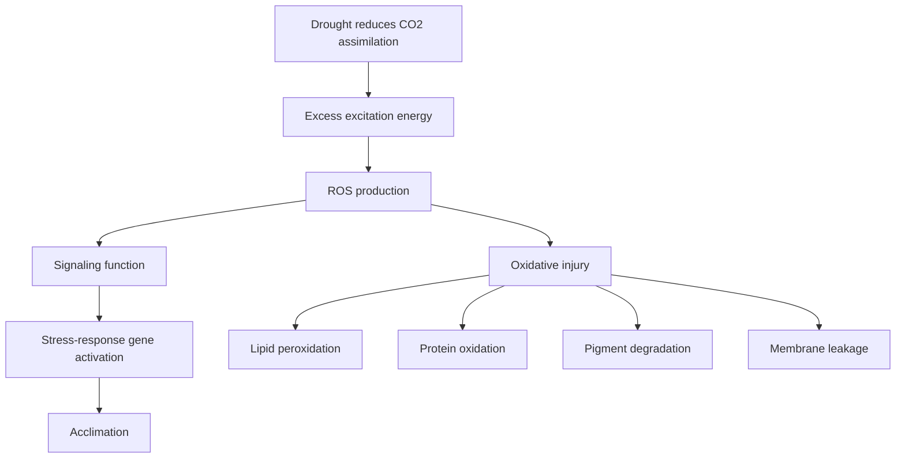

## ROS sources

- Chloroplasts
- Mitochondria
- Peroxisomes
- Plasma membrane NADPH oxidases
- Apoplast

## Antioxidant defense

| Defense component | Function |
|---|---|
| SOD | Converts superoxide to hydrogen peroxide |
| CAT | Detoxifies hydrogen peroxide |
| APX | Ascorbate-dependent peroxide detoxification |
| GR | Maintains glutathione redox cycling |
| Ascorbate | Non-enzymatic antioxidant |
| Glutathione | Redox buffering |
| Carotenoids | Photoprotection |
| Tocopherols | Lipid protection |
| Phenolics | Antioxidant and protective roles |

## Important caution

Higher antioxidant activity does not always mean better tolerance. It may indicate stronger defense, but it may also indicate greater stress injury. Interpret antioxidants together with MDA, electrolyte leakage, photosynthesis, growth, and yield.

---

# 12. Mechanism 6: Osmotic Adjustment and Compatible Solutes

Osmotic adjustment helps plants maintain cell hydration and turgor under low water potential.

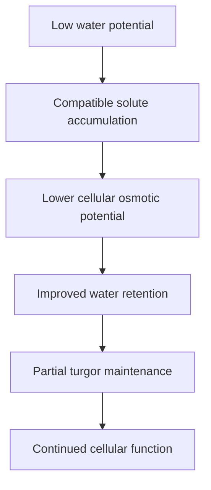

## Common compatible solutes

| Compound | Possible role |
|---|---|
| Proline | Osmotic adjustment, ROS scavenging, protein stabilization |
| Soluble sugars | Osmotic balance, carbon storage, signaling |
| Sucrose | Membrane and protein protection |
| Raffinose-family oligosaccharides | Dehydration protection |
| Glycine betaine | Photosystem and membrane protection |
| Polyamines | Membrane protection and stress signaling |
| GABA | Carbon-nitrogen balance and stress metabolism |

## Interpretation caution

Osmolyte accumulation can mean either adaptation or injury. For example, high proline may indicate osmotic adjustment, but it may also indicate severe stress. Link biochemical traits to physiological performance.

---

# 13. Mechanism 7: Root Architecture and Water Acquisition

Roots determine whether the plant can avoid drought by accessing water.

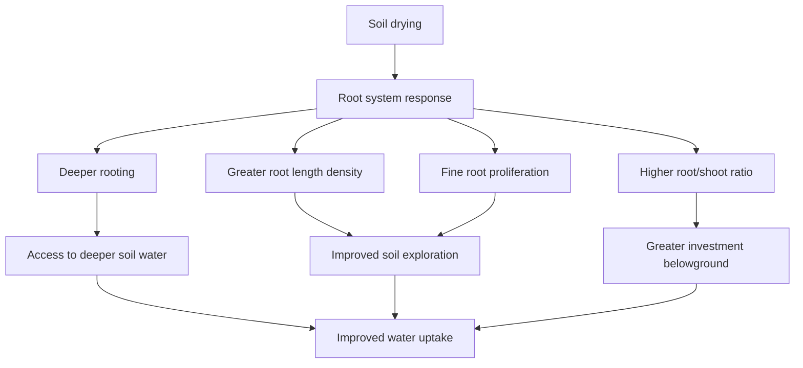

## Root traits

| Trait | Interpretation |
|---|---|
| Root depth | Access to deeper water |
| Total root length | Soil exploration capacity |
| Root length density | Spatial water acquisition |
| Root surface area | Absorptive capacity |
| Root volume | Root system size |
| Root diameter | Structural strategy |
| Specific root length | Fine-root strategy |
| Root dry weight | Carbon investment belowground |
| Root/shoot ratio | Allocation adjustment |
| Root hydraulic conductance | Functional water movement |

## Interpretation

Deep roots are useful only if deeper soil layers contain water. Fine roots are useful only if they increase water extraction without excessive carbon cost. Root traits must be interpreted with soil profile moisture.

---

# 14. Mechanism 8: Nutrient Uptake Under Drought

Drought reduces nutrient uptake because water flow to the root surface declines.

## Key nutrient processes affected by drought

- Mass flow
- Diffusion
- Root interception
- Root growth
- Microbial mineralization
- Nitrate mobility
- Potassium uptake
- Calcium transport
- Tissue nutrient redistribution

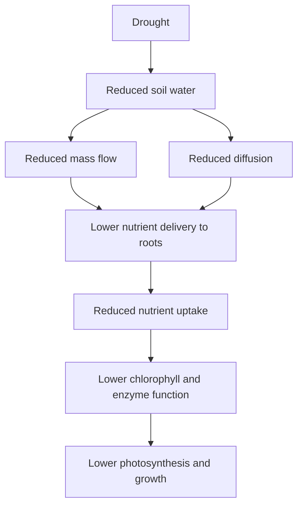

## Drought-sensitive nutrient traits

| Nutrient | Drought-related issue |
|---|---|
| N | Reduced uptake and assimilation; chlorophyll decline |
| K | Impaired stomatal regulation and osmotic balance |
| Ca | Reduced transpiration-linked transport |
| Mg | Chlorophyll and enzyme-related effects |
| P | Reduced diffusion in dry soil |
| Micronutrients | Reduced mobility and uptake depending on soil chemistry |

---

# 15. Mechanism 9: Reproductive Sensitivity

Reproductive development is often more drought-sensitive than vegetative growth.

## Sensitive processes

- Flower initiation
- Flower retention
- Pollen development
- Pollen viability
- Pollen germination
- Pollen tube growth
- Ovule fertility
- Silk emergence
- Anthesis-silking synchrony
- Fruit set
- Seed set
- Grain filling
- Fruit enlargement

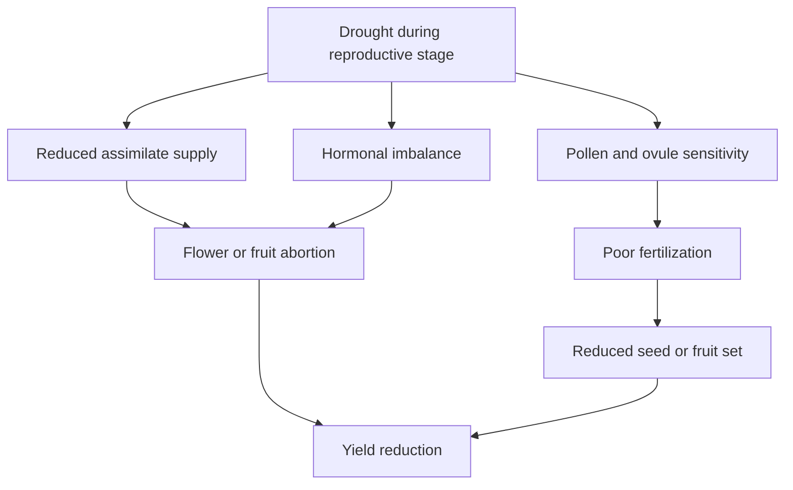

## Crop examples

| Crop | Drought-sensitive reproductive traits |
|---|---|
| Corn | Anthesis-silking interval, pollen viability, silk emergence, kernel set |
| Soybean | Flower retention, pod set, seed number, seed weight |
| Strawberry | Fruit number, fruit size, marketable yield |
| Watermelon | Flowering, fruit set, fruit size, marketable yield |
| Tomato | Flower abortion, pollen viability, fruit set |
| Cotton | Square retention, boll retention, lint yield |
| Quinoa | Panicle development, seed set, seed weight |

---

# 16. Avoidance, Tolerance, Escape, and Recovery

## Drought avoidance

The plant prevents severe internal water deficit.

Examples:

- Deeper roots
- Reduced leaf area
- Stomatal closure
- Leaf rolling
- Waxier cuticle
- Lower canopy conductance
- Improved hydraulic control

## Drought tolerance

The plant maintains function despite low internal water status.

Examples:

- Osmotic adjustment
- Membrane stability
- Antioxidant defense
- Protein protection
- Photosynthetic stability
- Desiccation tolerance in special species

## Drought escape

The plant completes its life cycle before severe drought.

Examples:

- Early flowering
- Rapid maturity
- Short crop duration

## Drought recovery

The plant resumes function after rewatering.

Examples:

- Stomatal reopening
- Photosynthetic recovery
- Root regrowth
- New leaf growth
- Reproductive compensation
- Biomass recovery

---

# 17. Drought Research Measurement Framework

## Before stress

| Trait group | Measurements |
|---|---|
| Baseline growth | Height, leaf number, leaf area |
| Water status | Soil moisture, RWC, water potential |
| Gas exchange | A, gsw, E, Ci |
| Fluorescence | Fv/Fm, ΦPSII |
| Pigments | Chlorophyll, flavonols, anthocyanins |
| Roots | Root length, root biomass if possible |

## During stress

| Trait group | Measurements |
|---|---|
| Stress intensity | Soil moisture, pot weight, water potential |
| Plant response | Wilting, leaf rolling, canopy temperature |
| Physiology | A, gsw, E, Ci, WUE |
| Photochemistry | Fv/Fm, ΦPSII, NPQ, ETR |
| Biochemistry | Proline, sugars, MDA, antioxidants |
| Hormones | ABA, JA, SA, cytokinins if available |

## After rewatering

| Trait group | Measurements |
|---|---|
| Recovery | Photosynthesis recovery, stomatal reopening |
| Growth | New leaves, biomass recovery |
| Roots | Root regrowth |
| Yield | Fruit/seed/grain recovery |
| Quality | Soluble solids, protein, oil, firmness, pigments |

---

# 18. Trait Prioritization Matrix

| Research goal | Minimum traits | Strong traits | Advanced traits |
|---|---|---|---|
| Screen cultivars | Biomass, yield, chlorophyll | A, gsw, canopy temperature, root traits | PCA, stress indices, spectral traits |
| Mechanistic physiology | A, gsw, RWC | A/Ci, fluorescence, water potential | ABA, antioxidants, hydraulics |
| Root-based drought study | Root dry weight | Root length, depth, surface area | Root hydraulic conductance, root imaging |
| Reproductive drought study | Yield, fruit/seed number | Pollen viability, fruit set | Hormones, assimilate partitioning |
| Remote sensing study | NDVI | NDRE, thermal, canopy cover | Hyperspectral, ML models |
| Recovery study | Biomass after rewatering | A recovery, gsw recovery | Root regrowth, metabolic recovery |

---

# 19. Recommended Infographics to Add

Create these as original diagrams in Canva, PowerPoint, BioRender, R, or Mermaid.

| Infographic | Suggested file name |
|---|---|
| Soil–plant–atmosphere drought pathway | `assets/infographics/drought-spac-pathway.png` |
| ABA and hydraulic signaling model | `assets/infographics/drought-aba-hydraulic-signaling.png` |
| Photosynthetic limitation under drought | `assets/infographics/drought-photosynthesis-limitation.png` |
| ROS and antioxidant defense | `assets/infographics/drought-ros-antioxidant-network.png` |
| Root architecture and drought avoidance | `assets/infographics/drought-root-architecture.png` |
| Drought trait selection matrix | `assets/infographics/drought-trait-selection-matrix.png` |
| Crop-stage drought sensitivity | `assets/infographics/drought-crop-stage-sensitivity.png` |

## Example image placeholder

```markdown
<p align="center">
  
</p>

<p align="center">
  <b>Figure 1.</b> Original conceptual model linking soil drying, plant hydraulics, stomatal regulation, photosynthesis, and yield loss.
</p>
```

---

# 20. Drought Indices

## Percent reduction

```text
Percent reduction = ((Control - Drought) / Control) × 100
```

## Relative performance

```text
Relative performance = Drought / Control
```

## Drought tolerance index

```text
DTI = Yield under drought / Yield under control
```

## Recovery index

```text
Recovery index = (Recovery value - Stress value) / (Control value - Stress value)
```

## Stress susceptibility index

```text
SSI = [1 - (Yd / Yc)] / SI
```

Where:

- `Yd` = yield under drought
- `Yc` = yield under control
- `SI` = stress intensity

## Interpretation caution

Indices are useful, but they can mislead if used alone. A genotype may have a high relative drought index simply because it performs poorly under control conditions. Always interpret indices together with absolute yield.

---

# 21. Common Mistakes in Drought Research

## Mistake 1: Treating drought as one condition

Drought differs by timing, severity, duration, soil type, VPD, and crop stage.

## Mistake 2: Ignoring atmospheric demand

High VPD can increase transpiration demand and cause stress even when soil moisture is not extremely low.

## Mistake 3: Measuring only final yield

Yield shows outcome but not mechanism.

## Mistake 4: Assuming high WUE always means high productivity

High WUE can result from very low stomatal conductance and reduced growth.

## Mistake 5: Ignoring roots

Drought avoidance often depends on root traits.

## Mistake 6: Ignoring recovery

A plant that suffers during drought but recovers quickly may be valuable under intermittent drought.

## Mistake 7: Overinterpreting proline

Proline can be protective, but it can also be a stress severity marker.

---

# 22. Crop-Specific Interpretation

## Corn

Key drought-sensitive processes:

- Leaf rolling
- Canopy temperature increase
- Pollen viability decline
- Delayed silk emergence
- Increased anthesis-silking interval
- Reduced kernel set
- Reduced grain filling

Important traits:

- ASI
- Silk emergence
- Pollen viability
- Canopy temperature
- Photosynthesis
- Root depth
- Kernel number
- Grain yield

---

## Soybean

Key drought-sensitive processes:

- Stomatal closure
- Flower abortion
- Pod abortion
- Reduced seed filling
- Altered protein and oil concentration

Important traits:

- Flower retention
- Pod set
- Seed number
- Seed weight
- Canopy temperature
- Photosynthesis
- Stomatal conductance
- Protein and oil

---

## Strawberry

Key drought-sensitive processes:

- Reduced leaf expansion
- Reduced gas exchange
- Reduced fruit enlargement
- Reduced fruit number
- Lower marketable yield
- Quality changes

Important traits:

- A, gsw, E
- Canopy temperature
- Fruit number
- Average fruit weight
- Marketable yield
- Soluble solids
- Firmness
- Anthocyanins

---

## Watermelon

Key drought-sensitive processes:

- Reduced vine growth
- Reduced transpiration cooling
- Reduced fruit set
- Reduced fruit size
- Lower marketable yield

Important traits:

- Vine length
- Stomatal conductance
- Canopy temperature
- Fruit set
- Fruit weight
- Marketable yield
- Rootstock effects

---

## Lettuce

Key drought-sensitive processes:

- Reduced leaf expansion
- Wilting
- Chlorophyll decline
- Reduced fresh weight
- Marketability loss

Important traits:

- Leaf area
- Fresh weight
- Chlorophyll
- Wilting score
- Tipburn risk
- Marketable quality

---

# 23. Data Analysis Strategy

## Basic analysis

- Summary statistics
- Treatment means
- Percent reduction
- Relative performance
- ANOVA or mixed model
- Post-hoc mean separation

## Advanced analysis

- Repeated-measures mixed models
- Genotype × drought interaction
- Stress × growth stage interaction
- Trait correlation network
- PCA
- Cluster analysis
- Regression between physiological traits and yield
- Stability analysis
- Multivariate drought ranking

## Interpretation workflow

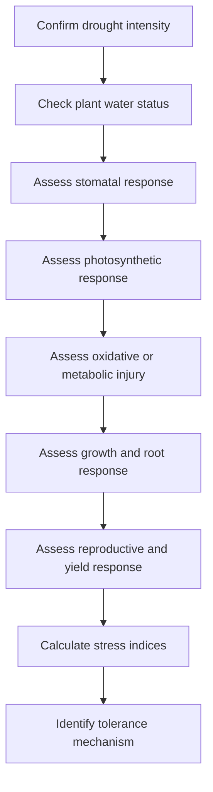

---

# 24. Research-Quality Drought Experiment Checklist

## Stress setup

- Define drought intensity clearly.
- Report soil moisture or substrate water content.
- Report irrigation strategy.
- Report stress duration.
- Report growth stage at stress imposition.
- Monitor VPD and temperature.
- Include recovery phase if relevant.

## Experimental design

- Use adequate replication.
- Randomize treatments.
- Account for pot position or field spatial variability.
- Use blocking when appropriate.
- Measure baseline traits before stress.
- Measure repeated traits during stress.

## Interpretation

- Separate stress intensity from plant response.
- Interpret absolute performance and relative performance.
- Avoid calling a genotype tolerant from one trait alone.
- Connect physiology to yield or quality.
- Report limitations.

---

# 25. Visual Summary Diagram

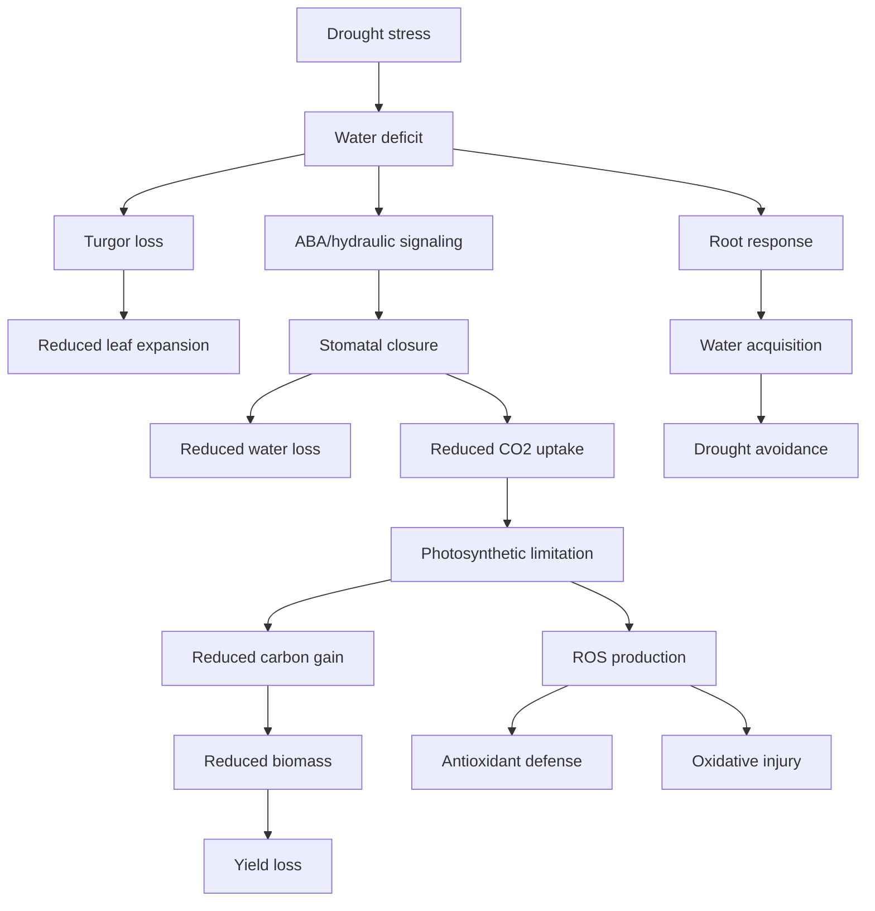

---

# 26. Key References to Build Around

Use these references to expand this page and future drought-related files.

## Foundational drought physiology

- Chaves, M. M., Maroco, J. P., & Pereira, J. S. Understanding plant responses to drought: from genes to the whole plant. *Functional Plant Biology*.
- Chaves, M. M., Flexas, J., & Pinheiro, C. Photosynthesis under drought and salt stress: regulation mechanisms from whole plant to cell. *Annals of Botany*.
- Flexas, J., & Medrano, H. Drought-inhibition of photosynthesis in C3 plants: stomatal and non-stomatal limitations revisited. *Annals of Botany*.
- Tardieu, F., Simonneau, T., & Muller, B. The physiological basis of drought tolerance in crop plants: a scenario-dependent probabilistic approach. *Annual Review of Plant Biology*.
- Passioura, J. B. Phenotyping for drought tolerance in grain crops: when is it useful to breeders? *Journal of Experimental Botany*.

## Stress signaling, metabolism, and ROS

- Zhu, J. K. Salt and drought stress signal transduction in plants. *Annual Review of Plant Biology*.
- Shinozaki, K., & Yamaguchi-Shinozaki, K. Gene networks involved in drought stress response and tolerance. *Journal of Experimental Botany*.
- Krasensky, J., & Jonak, C. Drought, salt, and temperature stress-induced metabolic rearrangements and regulatory networks. *Journal of Experimental Botany*.
- Mittler, R. Abiotic stress, the field environment and stress combination. *Trends in Plant Science*.
- Gill, S. S., & Tuteja, N. Reactive oxygen species and antioxidant machinery in abiotic stress tolerance. *Plant Physiology and Biochemistry*.

## Roots, hydraulics, and phenotyping

- Comas, L. H., Becker, S. R., Cruz, V. M. V., Byrne, P. F., & Dierig, D. A. Root traits contributing to plant productivity under drought. *Frontiers in Plant Science*.
- Lynch, J. P. Roots of the second green revolution. *Australian Journal of Botany*.
- Wasson, A. P., Richards, R. A., Chatrath, R., et al. Traits and selection strategies to improve root systems and water uptake in water-limited wheat crops. *Journal of Experimental Botany*.
- Ahmad, U., Alvino, A., & Marino, S. A review of crop water stress assessment using remote sensing. *Remote Sensing*.

## Books and broader references

- Taiz, L., Zeiger, E., Møller, I. M., & Murphy, A. *Plant Physiology and Development*.
- Lambers, H., Chapin, F. S., & Pons, T. L. *Plant Physiological Ecology*.
- Larcher, W. *Physiological Plant Ecology*.

---

# 27. Public GitHub Note

Use only:

- Original writing
- Original Mermaid diagrams
- Your own photos
- Open-license images with attribution
- Figures you create yourself
- Published or simulated datasets

Avoid:

- Textbook screenshots
- Publisher-owned figures
- Journal figures unless open-license reuse is clearly allowed
- Unpublished collaborator data
- Large copied passages from papers or books

---

# End of advanced drought stress physiology guide
