# Salinity Stress Physiology: Advanced Research Guide

## Purpose

This file is an advanced guide to salinity stress physiology in plants. It is designed for crop physiologists, horticultural scientists, plant stress researchers, breeders, graduate students, and anyone studying plant responses to salt-affected soils, saline irrigation water, or salt-induced osmotic and ionic stress.

Salinity stress is not only “too much salt.” It is a complex stress syndrome involving:

- Reduced soil water potential
- Osmotic stress
- Reduced root water uptake
- Na+ and Cl- accumulation
- K+ displacement
- Ionic imbalance
- Membrane injury
- Photosynthetic limitation
- Oxidative stress
- Hormonal crosstalk
- Root growth inhibition
- Leaf senescence
- Reduced biomass
- Yield and quality decline

This guide uses original explanations and original diagrams. It should be expanded with your own photos, open-license images, and properly cited research literature.

---

# 1. Conceptual Definition

<p align="center">
  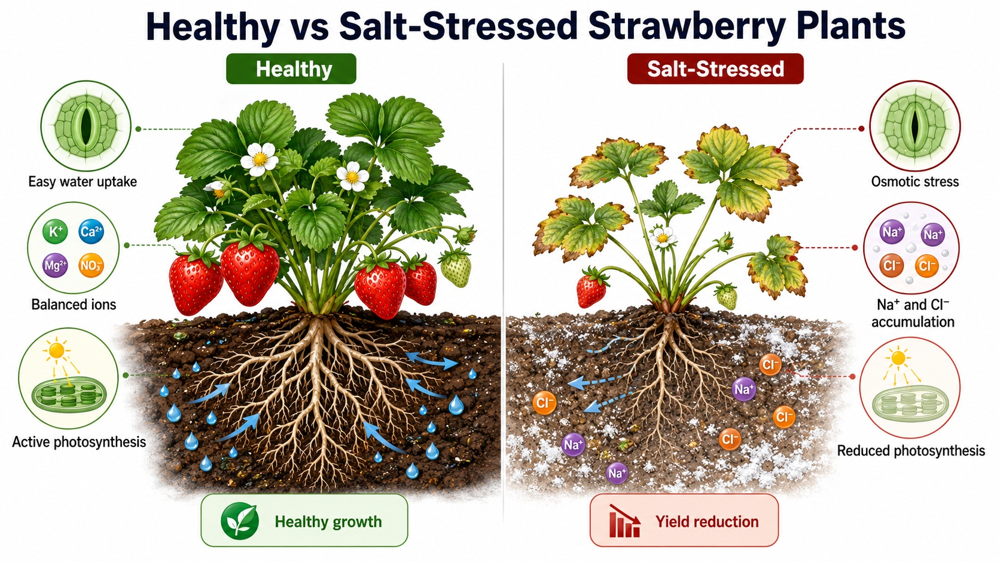
</p>

<p align="center">
  <b>Concept image.</b> A well-watered non-saline plant maintains water uptake, ionic balance, stomatal function, photosynthesis, and growth, whereas a salt-stressed plant experiences osmotic stress, Na+/Cl- toxicity, nutrient imbalance, chlorosis, leaf burn, and growth reduction.
</p>

> Image note: Upload your own image or an open-license image as  
> `assets/photos/healthy-vs-salt-stressed-plant.jpg`.

---

## What is salinity stress?

Salinity stress occurs when soluble salts accumulate in the root zone to levels that reduce plant growth, metabolism, development, yield, or quality.

The most common salinity problem in crop production involves high concentrations of:

- Sodium chloride: NaCl
- Sodium sulfate: Na2SO4
- Calcium chloride: CaCl2
- Magnesium chloride: MgCl2
- Mixed salts in irrigation water or soil solution

In plant physiology, salinity has two major components:

```text
High salt in root zone
        ↓
Osmotic stress
        ↓
Reduced water uptake and reduced growth

High Na+ and Cl- uptake
        ↓
Ionic stress
        ↓
Toxic ion accumulation, nutrient imbalance, senescence, and yield loss
```

---

# 2. Animated-Style Salinity Concept

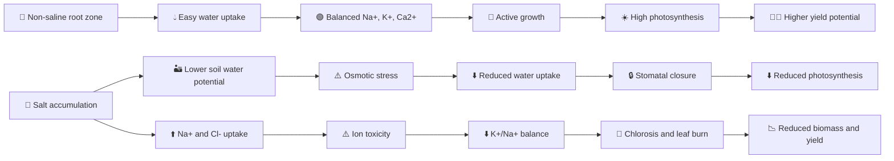

---

# 3. Why Salinity Is Biologically Different from Drought

Salinity and drought both create water limitation, but salinity adds an additional ionic toxicity component.

| Feature | Drought stress | Salinity stress |
|---|---|---|
| Primary trigger | Low soil water availability | High soluble salt concentration |
| Main early effect | Low water uptake | Low water uptake due to osmotic stress |
| Additional toxicity | Usually no direct ion toxicity | Na+ and Cl- toxicity |
| Key ion issue | Nutrient uptake may decline | Na+ competes with K+, Ca2+, and other nutrients |
| Leaf symptom | Wilting, rolling, senescence | Chlorosis, necrosis, marginal burn, senescence |
| Major tolerance traits | Root water uptake, stomatal control, recovery | Osmotic tolerance, ion exclusion, tissue tolerance |
| Key lab measurements | Soil moisture, water potential, RWC | EC, Na+, K+, Cl-, K+/Na+, tissue ions |

---

# 4. Two-Phase Model of Salinity Response

A very useful way to interpret salinity stress is the two-phase model.

## Phase 1: Osmotic Phase

The osmotic phase begins quickly after salt exposure.

High salt in the soil solution lowers external water potential. The plant experiences difficulty taking up water even if the soil looks physically wet.

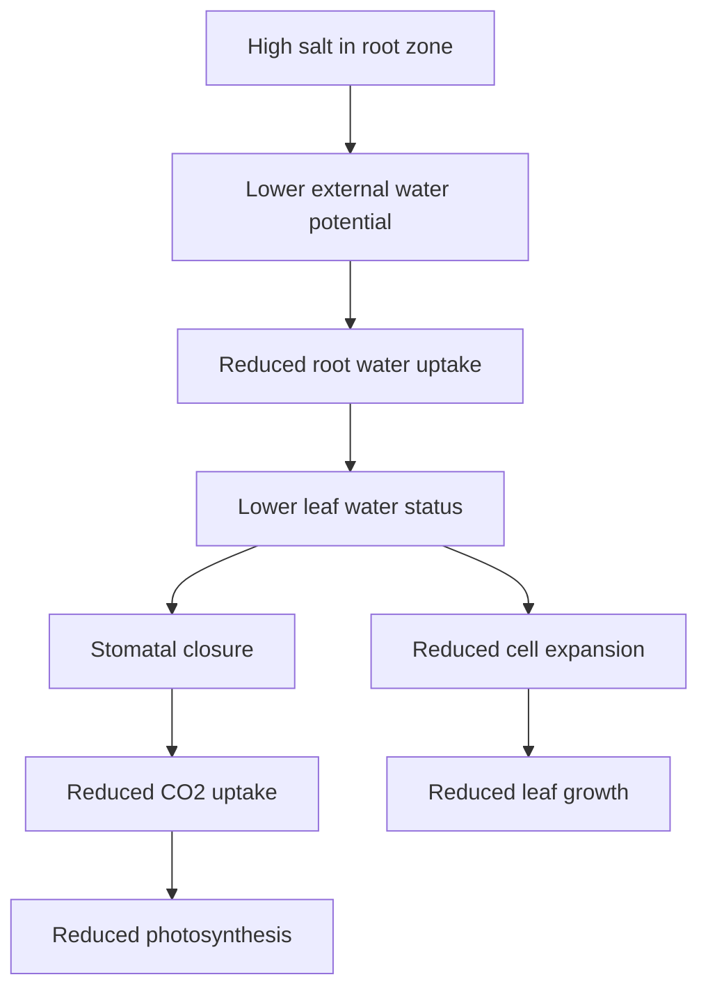

### Typical early responses

- Reduced leaf expansion
- Reduced shoot growth
- Stomatal closure
- Reduced transpiration
- Reduced photosynthesis
- Increased root-to-shoot adjustment
- ABA-related signaling
- Early changes in root architecture

### Early traits to measure

| Trait | Interpretation |
|---|---|
| Root-zone EC | Salt intensity |
| Substrate water potential | Osmotic limitation |
| Leaf expansion rate | Early growth sensitivity |
| Stomatal conductance | Water-conservation response |
| Transpiration | Water loss |
| Photosynthesis | Carbon assimilation |
| Leaf water potential | Plant water status |
| Relative water content | Leaf hydration |

---

## Phase 2: Ionic Phase

The ionic phase develops more slowly as Na+ and Cl- accumulate in plant tissues, especially leaves.

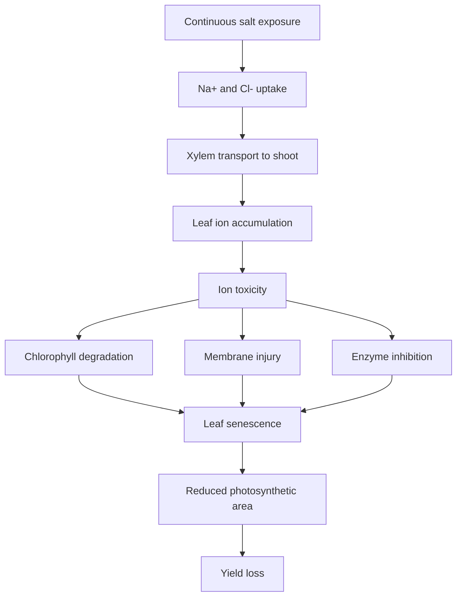

### Typical late responses

- Leaf chlorosis
- Marginal leaf burn
- Necrosis
- Premature leaf senescence
- Reduced photosynthetic leaf area
- Reduced biomass
- Poor reproductive development
- Yield and quality decline

### Late traits to measure

| Trait | Interpretation |
|---|---|
| Shoot Na+ | Degree of sodium accumulation |
| Shoot Cl- | Chloride toxicity risk |
| Root Na+ | Root retention or uptake |
| K+ | Essential nutrient balance |
| K+/Na+ ratio | Ion homeostasis |
| Leaf injury score | Visible toxicity |
| Chlorophyll | Pigment retention |
| Electrolyte leakage | Membrane injury |
| Biomass | Growth response |
| Yield | Agronomic outcome |

---

# 5. Major Salinity Tolerance Mechanisms

Salinity tolerance is not one trait. It is an integrated outcome of multiple mechanisms.

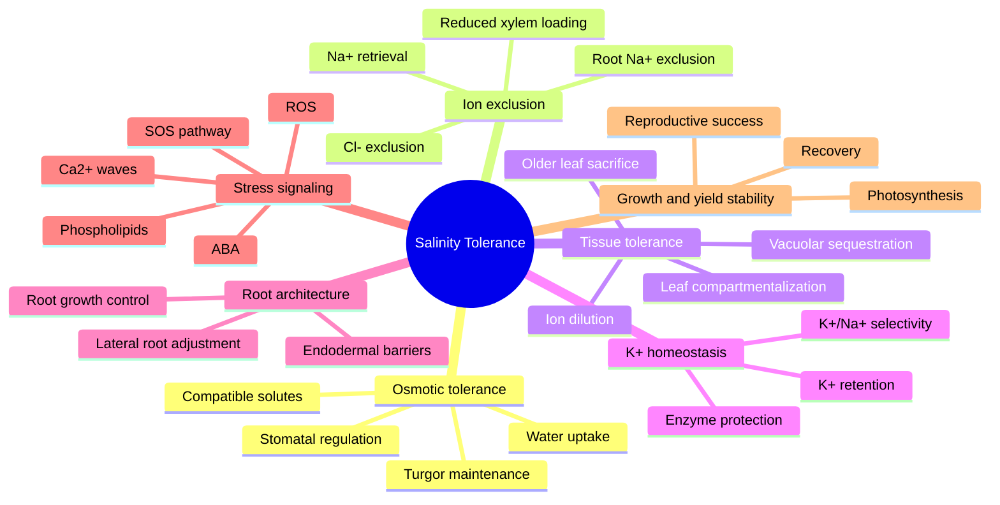

---

# 6. Mechanism 1: Osmotic Stress Tolerance

Osmotic stress tolerance is the ability of plants to maintain growth and function when external water potential is reduced by salt.

## Biological logic

Salt lowers the water potential of the soil solution. Water becomes harder for roots to absorb. The plant responds similarly to drought at first, even though the soil may still appear moist.

## Mechanism

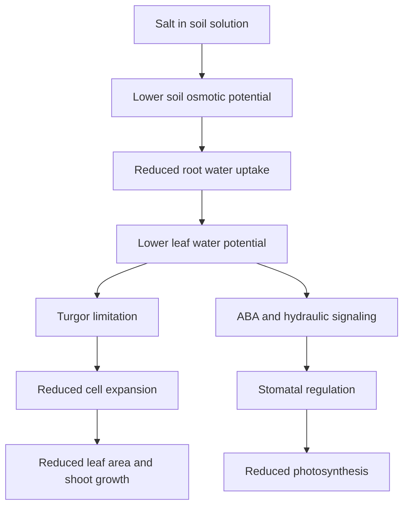

## Adaptive responses

- Osmotic adjustment
- Stomatal regulation
- Root water uptake adjustment
- Increased compatible solutes
- Maintenance of cell turgor
- Reduced leaf expansion
- Altered shoot/root allocation

## Key traits

| Trait | Interpretation |
|---|---|
| Leaf water potential | Plant water stress level |
| RWC | Leaf hydration |
| Stomatal conductance | Water regulation |
| Transpiration | Water loss |
| Leaf expansion rate | Osmotic growth sensitivity |
| Proline | Osmotic/metabolic response |
| Soluble sugars | Osmotic adjustment and carbon status |
| Glycine betaine | Compatible solute response |
| Biomass reduction | Growth penalty |

---

# 7. Mechanism 2: Na+ Exclusion

Na+ exclusion is the ability to reduce sodium movement into sensitive shoot tissues.

## Main idea

A salt-tolerant plant often keeps Na+ away from photosynthetically active leaves.

Na+ exclusion can occur through:

- Reduced Na+ entry into roots
- Na+ efflux from root epidermal/cortical cells
- Reduced xylem loading
- Retrieval of Na+ from xylem
- Retention of Na+ in roots or older tissues
- Reduced Na+ transport to young leaves

## Diagram

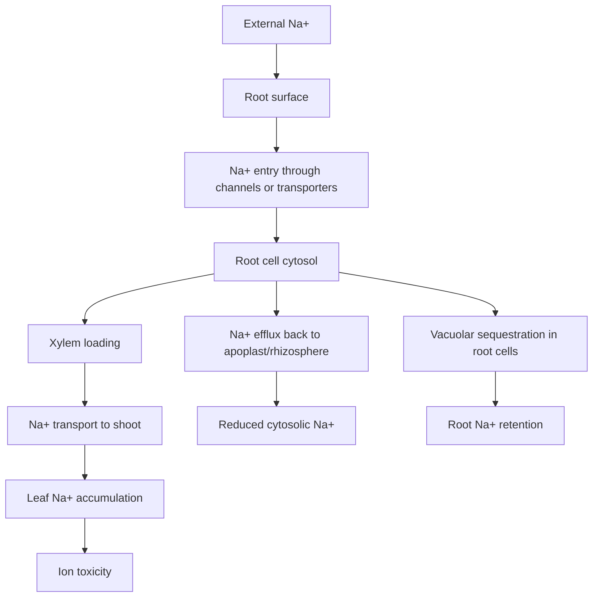

## Important transport-related concepts

| Process | Biological function |
|---|---|
| Na+ influx control | Limits entry into root cells |
| Na+ efflux | Removes Na+ from cytosol |
| Xylem loading control | Reduces Na+ transport to shoots |
| Xylem retrieval | Pulls Na+ out of transpiration stream |
| Root sequestration | Stores Na+ in less sensitive compartments |
| Shoot exclusion | Protects leaves and meristems |

## Key traits

- Root Na+
- Shoot Na+
- Old leaf Na+
- Young leaf Na+
- Na+ exclusion index
- Shoot/root Na+ ratio
- Xylem sap Na+
- Leaf injury score
- Photosynthesis
- Biomass

---

# 8. Mechanism 3: Cl- Exclusion and Chloride Toxicity Management

Chloride is often overlooked because sodium receives more attention. However, Cl- can be highly damaging in many crops, especially horticultural and woody species.

## Why Cl- matters

Cl- can accumulate in leaves and contribute to:

- Leaf burn
- Marginal necrosis
- Chlorosis
- Premature senescence
- Reduced photosynthesis
- Reduced transpiration
- Fruit quality changes

## Mechanism

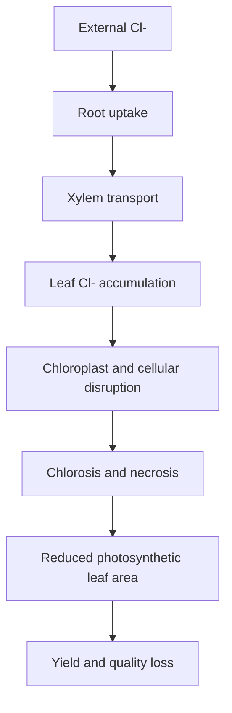

## Important traits

| Trait | Interpretation |
|---|---|
| Leaf Cl- | Chloride toxicity risk |
| Root Cl- | Uptake and retention |
| Shoot/root Cl- ratio | Transport pattern |
| Leaf burn score | Visual toxicity |
| Chlorophyll | Pigment injury |
| Photosynthesis | Functional impact |
| Yield quality | Crop marketability |

---

# 9. Mechanism 4: K+/Na+ Homeostasis

Maintaining K+ while restricting Na+ is one of the most important salinity tolerance strategies.

## Why K+ is critical

Potassium is required for:

- Enzyme activation
- Osmotic regulation
- Stomatal function
- Protein synthesis
- Membrane potential
- Photosynthesis
- Phloem transport
- Fruit quality

Excess Na+ disrupts many of these functions because Na+ competes with K+.

## Mechanism

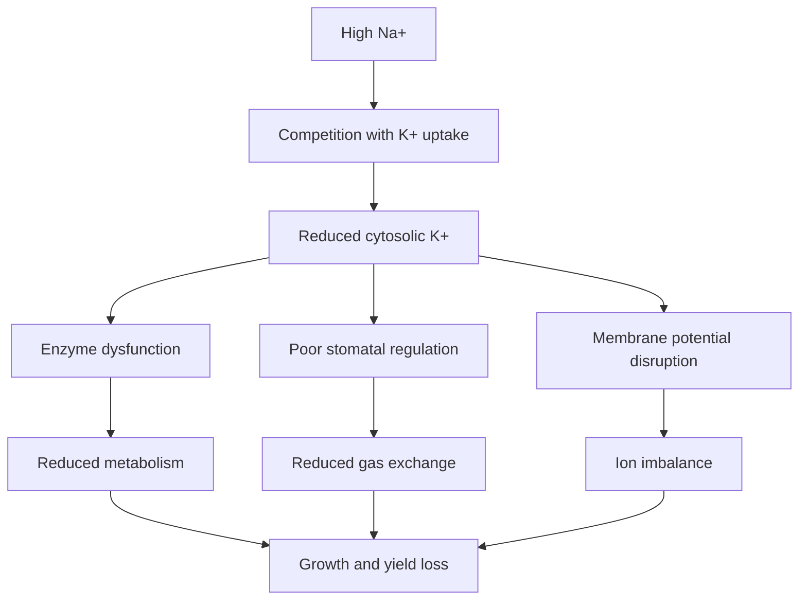

## Key traits

| Trait | Interpretation |
|---|---|
| Shoot K+ | Nutrient status |
| Root K+ | Root ion balance |
| K+/Na+ ratio | Ion homeostasis |
| K retention | Salt tolerance indicator |
| Stomatal conductance | K-dependent guard cell function |
| Photosynthesis | Functional ion balance |
| Biomass | Whole-plant outcome |

## Interpretation

A high K+/Na+ ratio is often more informative than Na+ alone because it reflects both toxic ion exclusion and maintenance of essential nutrient function.

---

# 10. Mechanism 5: SOS Signaling Pathway

The Salt Overly Sensitive pathway is one of the best-known ion homeostasis pathways in plants.

## Simplified SOS model

Salt stress can trigger cytosolic Ca2+ signals. Calcium sensors and interacting protein kinases activate Na+/H+ antiport systems, including SOS1, to help remove Na+ from the cytosol or regulate long-distance Na+ transport.

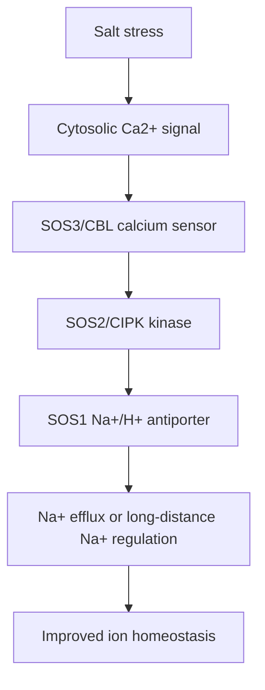

## Research interpretation

The SOS pathway is important because it connects:

- Salt perception
- Calcium signaling
- Protein kinase activation
- Na+ transport
- Ion homeostasis
- Salinity tolerance

## Important traits for pathway-level studies

- Cytosolic Ca2+ signaling
- SOS1/SOS2/SOS3 expression
- Na+ efflux
- H+ flux
- Root Na+
- Shoot Na+
- K+/Na+
- Growth under salt stress

---

# 11. Mechanism 6: Vacuolar Sequestration and Tissue Tolerance

Some plants tolerate salt not by excluding ions completely, but by storing ions safely.

## Tissue tolerance

Tissue tolerance is the ability to maintain metabolic function despite ion accumulation in tissues.

Mechanisms include:

- Sequestration of Na+ into vacuoles
- Sequestration of Cl- into vacuoles
- Ion compartmentalization in older leaves
- Succulence or dilution
- Protection of cytosolic enzymes
- Maintenance of chloroplast function
- Osmotic balancing using inorganic ions and compatible solutes

## Diagram

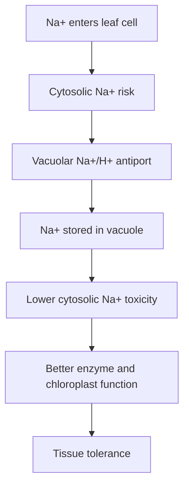

## Key traits

| Trait | Interpretation |
|---|---|
| Leaf Na+ | Ion load |
| Cell sap Na+ | Tissue ion status |
| Vacuolar sequestration markers | Compartmentation capacity |
| Chlorophyll retention | Tissue function |
| Fv/Fm | Photosystem stability |
| Leaf longevity | Tissue tolerance |
| Photosynthesis | Functional tolerance |

---

# 12. Mechanism 7: Compatible Solutes and Osmotic Adjustment

Plants may accumulate compatible solutes to maintain osmotic balance without disrupting metabolism.

## Common compatible solutes under salinity

- Proline
- Glycine betaine
- Soluble sugars
- Sucrose
- Trehalose
- Sugar alcohols
- Organic acids
- Amino acids
- Polyamines

## Biological functions

| Function | Explanation |
|---|---|
| Osmotic adjustment | Helps maintain water uptake and turgor |
| Protein protection | Stabilizes enzymes and proteins |
| Membrane protection | Reduces salt-induced membrane disruption |
| ROS detoxification | Some solutes contribute to antioxidant defense |
| Carbon and nitrogen balance | Reflects metabolic adjustment |

## Interpretation caution

High proline or sugar does not always mean tolerance. Sometimes it means the plant is highly stressed. Interpret compatible solutes with growth, ion content, photosynthesis, and injury traits.

---

# 13. Mechanism 8: Root Architecture and Root Plasticity

Roots are the first plant organ exposed to salinity.

Salt affects:

- Primary root elongation
- Lateral root formation
- Root hair growth
- Root angle
- Root branching
- Root hydraulic conductance
- Endodermal barrier development
- Rhizosphere interactions

## Diagram

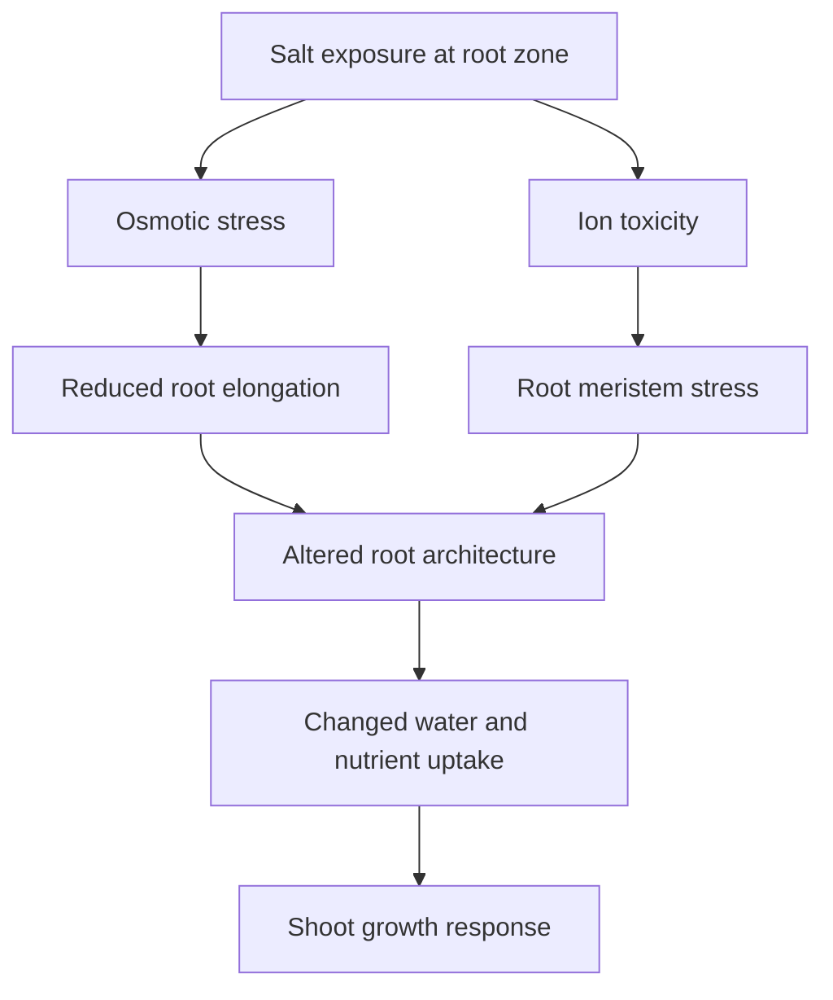

## Traits

| Trait | Interpretation |
|---|---|
| Primary root length | Root elongation sensitivity |
| Lateral root density | Root plasticity |
| Root hair density | Absorptive surface response |
| Root surface area | Resource acquisition |
| Root volume | Root system size |
| Root dry weight | Belowground biomass |
| Root/shoot ratio | Allocation shift |
| Root Na+ | Root ion retention |
| Root K+ | Root ion homeostasis |

---

# 14. Mechanism 9: Water Transport and Aquaporins

Salinity can reduce water transport not only by lowering external water potential but also by altering root hydraulic conductivity.

## Key concepts

- Aquaporins regulate membrane water movement.
- Salt stress can rapidly alter aquaporin activity.
- Root hydraulic conductance may decline under salinity.
- Reduced water transport contributes to early osmotic growth inhibition.
- ABA, Ca2+, pH, ROS, and phosphorylation may regulate aquaporin activity.

## Traits

- Root hydraulic conductance
- Leaf water potential
- Relative water content
- Transpiration
- Aquaporin gene expression
- Root pressure
- Water-use efficiency

---

# 15. Mechanism 10: Photosynthetic Limitation Under Salinity

Salinity reduces photosynthesis through multiple pathways.

## Stomatal limitation

- Osmotic stress reduces water uptake.
- Stomata close.
- CO2 diffusion decreases.
- Photosynthesis declines.

## Non-stomatal limitation

- Chlorophyll degradation
- Ion toxicity in chloroplasts
- Reduced PSII efficiency
- Reduced Rubisco activity
- Reduced electron transport
- Oxidative stress
- Leaf senescence
- Sink limitation

## Diagram

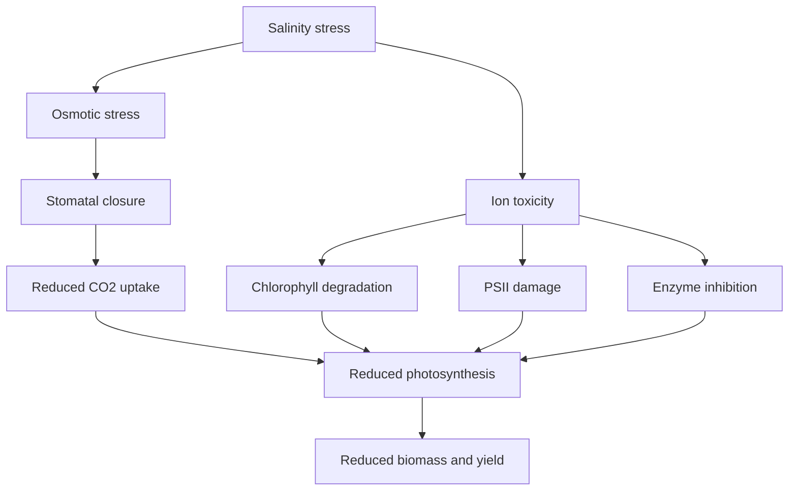

## Traits

| Trait | Interpretation |
|---|---|
| A or Pn | Net carbon assimilation |
| gsw | Stomatal limitation |
| E | Water loss |
| Ci | CO2 balance |
| Fv/Fm | PSII maximum efficiency |
| ΦPSII | Operating PSII efficiency |
| ETR | Electron transport |
| NPQ | Heat dissipation |
| Chlorophyll | Pigment retention |
| NDVI/NDRE | Canopy-level greenness |

---

# 16. Mechanism 11: ROS and Oxidative Stress

Salt stress can disturb metabolism, photosynthesis, membrane transport, and mitochondrial/chloroplast function, causing ROS accumulation.

## ROS sources

- Chloroplasts
- Mitochondria
- Peroxisomes
- Plasma membrane NADPH oxidases
- Apoplast

## ROS functions

At controlled levels:

- Signal transduction
- Stress acclimation
- Defense activation

At excessive levels:

- Lipid peroxidation
- Protein oxidation
- Pigment loss
- Membrane leakage
- DNA damage
- Cell death

## Diagram

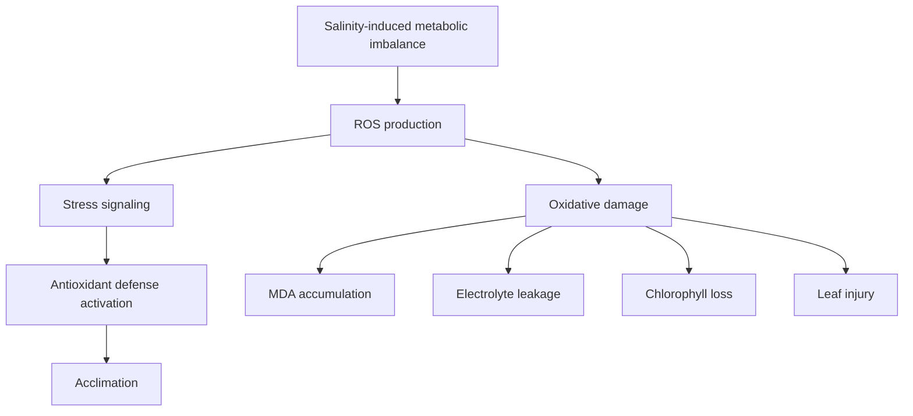

## Traits

- MDA
- Electrolyte leakage
- Hydrogen peroxide
- Superoxide
- SOD
- CAT
- APX
- GR
- Ascorbate
- Glutathione
- Total antioxidant capacity
- Leaf injury score

---

# 17. Mechanism 12: Hormonal Crosstalk Under Salinity

Salinity responses are regulated by multiple hormones.

| Hormone | Role under salinity |
|---|---|
| ABA | Osmotic stress response, stomatal closure, root growth regulation |
| Ethylene | Root architecture, senescence, stress adaptation |
| Auxin | Lateral roots, root plasticity, growth redistribution |
| Cytokinin | Shoot growth, senescence regulation, source-sink balance |
| JA | Defense and stress signaling |
| SA | Oxidative stress and defense signaling |
| Gibberellins | Growth regulation under stress |
| Brassinosteroids | Stress tolerance and antioxidant protection |
| Strigolactones | Root architecture and rhizosphere response |

## Diagram

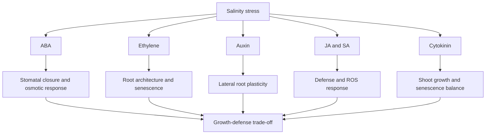

---

# 18. Mechanism 13: Cell Wall, Growth, and Developmental Plasticity

Salinity strongly affects growth by altering cell expansion, cell wall properties, cytoskeleton organization, and developmental programs.

## Important processes

- Reduced cell expansion
- Reduced cell division
- Cell wall stiffening or remodeling
- Sustained cellulose synthesis under stress
- Root growth inhibition
- Altered lateral root development
- Altered shoot architecture
- Earlier senescence
- Reduced reproductive growth

## Traits

- Leaf expansion rate
- Primary root elongation
- Lateral root density
- Leaf area
- Plant height
- Biomass
- Cell wall-related gene expression
- Growth recovery after stress removal

---

# 19. Salinity Symptoms

## Early symptoms

- Reduced growth
- Smaller leaves
- Reduced leaf expansion
- Mild wilting despite moist soil
- Reduced stomatal conductance
- Reduced transpiration
- Lower photosynthesis

## Later symptoms

- Leaf chlorosis
- Leaf tip burn
- Marginal necrosis
- Premature senescence
- Poor root growth
- Reduced flowering
- Poor fruit set
- Smaller fruits or seeds
- Yield reduction

## Severe symptoms

- Extensive necrosis
- Defoliation
- Root death
- Meristem injury
- Plant death

---

# 20. Measurement Framework

## 20.1 Stress intensity

| Measurement | Importance |
|---|---|
| Irrigation water EC | Salt input |
| Substrate or soil EC | Root-zone salinity |
| Soil solution Na+ | Sodium pressure |
| Soil solution Cl- | Chloride pressure |
| pH | Nutrient availability and ion chemistry |
| SAR | Sodium adsorption risk |
| Leachate EC | Salt accumulation monitoring |

## 20.2 Physiological response

| Trait | Importance |
|---|---|
| Photosynthesis | Functional carbon assimilation |
| Stomatal conductance | Osmotic/stomatal response |
| Transpiration | Water loss and salt transport |
| Chlorophyll fluorescence | Photochemical injury |
| Chlorophyll content | Pigment stability |
| Canopy temperature | Stomatal and water status |
| RWC | Hydration |
| Leaf water potential | Water stress intensity |

## 20.3 Ionic response

| Trait | Importance |
|---|---|
| Na+ | Sodium toxicity |
| Cl- | Chloride toxicity |
| K+ | Nutrient balance |
| Ca2+ | Membrane and signaling function |
| Mg2+ | Chlorophyll and enzyme function |
| K+/Na+ | Ion homeostasis |
| Ca2+/Na+ | Membrane/nutrient protection |
| Shoot/root Na+ | Transport pattern |

## 20.4 Growth and yield response

| Trait | Importance |
|---|---|
| Root length | Root sensitivity |
| Shoot biomass | Growth penalty |
| Root/shoot ratio | Allocation |
| Leaf area | Canopy development |
| Flowering | Reproductive response |
| Fruit/seed number | Reproductive success |
| Average fruit/seed weight | Sink development |
| Marketable yield | Practical crop outcome |
| Quality traits | Market and nutritional value |

---

# 21. Recommended Trait Sets

## Minimum trait set

Use when resources are limited.

| Category | Traits |
|---|---|
| Stress intensity | Root-zone EC |
| Growth | Plant height, biomass |
| Physiology | Chlorophyll, stomatal conductance |
| Ion status | Shoot Na+, K+ |
| Outcome | Yield or survival |

## Strong publishable trait set

| Category | Traits |
|---|---|
| Stress intensity | Irrigation EC, leachate EC, root-zone EC |
| Water status | RWC, leaf water potential |
| Gas exchange | A, gsw, E, Ci |
| Fluorescence | Fv/Fm, ΦPSII, ETR, NPQ |
| Pigments | Chlorophyll, anthocyanins, flavonols |
| Ions | Na+, K+, Cl-, Ca2+, Mg2+, K+/Na+ |
| Injury | Leaf burn score, electrolyte leakage, MDA |
| Growth | Root traits, shoot biomass |
| Outcome | Yield and quality |

## Advanced mechanistic trait set

| Category | Traits |
|---|---|
| Signaling | Ca2+ imaging, ABA, ethylene-related traits |
| Gene expression | SOS1, NHX, HKT, AKT, HAK, aquaporins |
| Ion flux | Na+, K+, H+ flux using ion-selective microelectrodes |
| Compartmentation | Vacuolar ion localization |
| Root anatomy | Endodermal barriers, Casparian strip, suberin |
| Imaging | Hyperspectral, fluorescence imaging, thermal imaging |
| Omics | Transcriptomics, ionomics, metabolomics, proteomics |
| Modeling | Ion transport models, crop salinity response curves |

---

# 22. Salinity Tolerance Types

## 22.1 Osmotic tolerance

Plant maintains growth despite low external water potential.

Indicators:

- Smaller reduction in leaf expansion
- Better stomatal regulation
- Maintained water status
- Maintained photosynthesis early after salinity exposure

## 22.2 Ion exclusion

Plant restricts Na+ or Cl- accumulation in sensitive shoot tissues.

Indicators:

- Lower shoot Na+
- Lower leaf Cl-
- Lower shoot/root Na+ ratio
- Higher K+/Na+
- Delayed leaf injury

## 22.3 Tissue tolerance

Plant maintains function despite ion accumulation.

Indicators:

- High leaf ion concentration but low injury
- Chlorophyll retention
- Long leaf lifespan
- Stable photosynthesis
- Vacuolar sequestration capacity

## 22.4 Recovery capacity

Plant resumes growth after salt stress is reduced.

Indicators:

- New leaf growth
- Photosynthetic recovery
- Root regrowth
- Reduced injury progression
- Yield compensation

---

# 23. Salinity Indices

## Percent reduction

```text
Percent reduction = ((Control - Salt treatment) / Control) × 100
```

## Relative performance

```text
Relative performance = Salt treatment value / Control value
```

## Salt tolerance index

```text
Salt tolerance index = Yield under salinity / Yield under control
```

## Ion exclusion index

```text
Na+ exclusion index = 1 - (Shoot Na+ under salinity / Maximum shoot Na+ among genotypes)
```

## K+/Na+ ratio

```text
K+/Na+ ratio = Tissue K+ concentration / Tissue Na+ concentration
```

## Relative chlorophyll retention

```text
Chlorophyll retention = Chlorophyll under salinity / Chlorophyll under control
```

## Interpretation caution

A genotype with low Na+ is not automatically salt tolerant if it also has poor growth. A genotype with high tissue Na+ may still be tolerant if it compartmentalizes ions and maintains photosynthesis. Use ion traits with growth, physiology, and yield.

---

# 24. Experimental Design Considerations

## Salt source

Common choices:

- NaCl
- Mixed salts
- Saline irrigation water
- Field salt-affected soil
- Gradual salinization
- Sudden salt shock

## Important design decisions

| Design decision | Why it matters |
|---|---|
| Gradual vs sudden salt addition | Avoids artificial shock effects |
| Salt concentration | Determines stress intensity |
| EC monitoring | Confirms actual root-zone salinity |
| Leaching fraction | Affects salt accumulation |
| Growth stage | Seedling, vegetative, reproductive responses differ |
| Duration | Separates osmotic and ionic phases |
| Recovery phase | Tests resilience |
| Tissue sampling time | Ion accumulation is time-dependent |
| Pot size | Affects root restriction and salt dynamics |
| Replication | Essential for genotype screening |

## Suggested salinity levels

These depend strongly on crop sensitivity, but common controlled-environment treatments include:

| Level | Approximate interpretation |
|---|---|
| Control | Non-saline baseline |
| Mild salinity | Growth reduction begins |
| Moderate salinity | Physiological and ion effects clear |
| Severe salinity | Visible injury and strong growth reduction |
| Recovery | Leaching or return to non-saline irrigation |

Always report EC rather than only NaCl concentration because EC better reflects root-zone salt intensity.

---

# 25. Crop-Specific Interpretation

## Lettuce

Likely responses:

- Leaf expansion reduction
- Tip burn risk
- Chlorosis
- Fresh weight reduction
- Marketability loss

Important traits:

- Fresh weight
- Leaf number
- SPAD/chlorophyll
- Na+, K+, Ca2+
- Leaf burn score
- Marketable quality

---

## Tomato

Likely responses:

- Reduced vegetative growth
- Reduced fruit size under severe salinity
- Possible soluble solids increase under mild/moderate salinity
- Blossom-end rot risk if Ca transport is affected
- Leaf Cl- or Na+ toxicity depending on cultivar/rootstock

Important traits:

- Plant height
- Leaf gas exchange
- Fruit number
- Fruit weight
- TSS
- Firmness
- Blossom-end rot incidence
- Na+, K+, Ca2+, Cl-

---

## Strawberry

Likely responses:

- Reduced leaf expansion
- Reduced gas exchange
- Leaf margin burn
- Reduced fruit size
- Reduced marketable yield
- Fruit quality shifts

Important traits:

- Photosynthesis
- Stomatal conductance
- Chlorophyll
- Na+, Cl-, K+, Ca2+
- Fruit number
- Fruit weight
- Marketable yield
- Soluble solids
- Firmness
- Anthocyanins

---

## Soybean

Likely responses:

- Reduced nodulation under salinity
- Reduced photosynthesis
- Ion toxicity
- Reduced pod set and seed weight
- Altered protein/oil response

Important traits:

- Nodulation
- Photosynthesis
- Chlorophyll
- Na+, K+, Cl-
- Pod number
- Seed weight
- Protein and oil

---

## Corn

Likely responses:

- Reduced emergence under salinity
- Reduced leaf expansion
- Reduced photosynthesis
- Ion imbalance
- Reproductive sensitivity under severe salinity

Important traits:

- Emergence
- Plant height
- Leaf area
- Chlorophyll
- Photosynthesis
- Na+, K+
- Biomass
- Grain yield

---

## Watermelon

Likely responses:

- Reduced vine growth
- Reduced root function
- Fruit set reduction under severe stress
- Fruit size reduction
- Rootstock-dependent salt tolerance

Important traits:

- Vine length
- Root traits
- Gas exchange
- Na+, K+, Cl-
- Fruit number
- Fruit weight
- Marketable yield
- Fruit quality

---

# 26. Visual Infographics to Create

Create original diagrams and upload them later.

| Infographic | Suggested file name |
|---|---|
| Osmotic phase vs ionic phase | `assets/infographics/salinity-two-phase-model.png` |
| Na+ exclusion pathway | `assets/infographics/salinity-na-exclusion.png` |
| K+/Na+ balance | `assets/infographics/salinity-k-na-homeostasis.png` |
| SOS pathway | `assets/infographics/salinity-sos-pathway.png` |
| Vacuolar sequestration | `assets/infographics/salinity-vacuolar-sequestration.png` |
| Salinity trait framework | `assets/infographics/salinity-trait-selection.png` |
| Crop-specific salinity injury | `assets/infographics/salinity-crop-symptoms.png` |

## Example image placeholder

```html
<p align="center">
  
</p>

<p align="center">
  <b>Figure 1.</b> Original conceptual model showing the rapid osmotic phase and slower ionic phase of salinity stress.
</p>
```

---

# 27. Data Analysis Strategy

## Basic analysis

- Treatment means
- Percent reduction
- ANOVA or mixed models
- Post-hoc mean separation
- Salt tolerance index
- K+/Na+ ratio analysis

## Intermediate analysis

- Genotype × salinity interaction
- Regression of yield against EC
- Regression of injury against Na+ or Cl-
- Correlation among Na+, K+, K+/Na+, photosynthesis, and yield
- PCA for multi-trait salinity tolerance

## Advanced analysis

- Repeated-measures mixed models
- Time-course modeling of osmotic and ionic phases
- Segmented regression for salinity threshold
- Maas-Hoffman yield-EC response
- Multivariate tolerance ranking
- Structural equation modeling
- Ion transport network analysis
- Ionomics × physiology integration
- Spectral trait prediction of salt injury

---

# 28. Interpretation Workflow

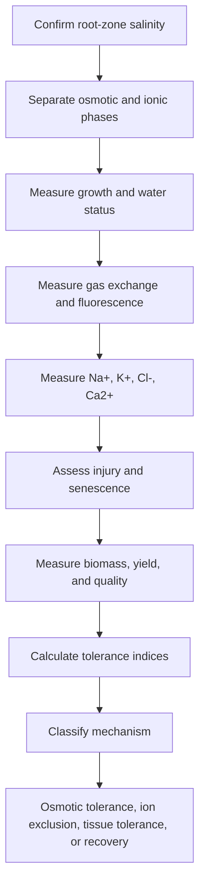

---

# 29. Common Mistakes in Salinity Research

## Mistake 1: Reporting only NaCl concentration

Report EC because EC reflects the salinity experienced by roots.

## Mistake 2: Ignoring chloride

Cl- can be highly damaging, especially in some horticultural crops.

## Mistake 3: Confusing osmotic tolerance with ion exclusion

Early growth response may reflect osmotic stress; later leaf injury may reflect ion toxicity.

## Mistake 4: Measuring ions only once

Ion accumulation is time-dependent and tissue-specific.

## Mistake 5: Calling low Na+ “tolerance” without yield data

Low Na+ matters only if it supports growth, physiology, and yield.

## Mistake 6: Using sudden salt shock only

Sudden NaCl shock may not represent field salinity. Gradual salinization often better mimics agricultural conditions.

## Mistake 7: Ignoring crop-specific responses

Tomato, strawberry, lettuce, soybean, corn, watermelon, and halophytes differ strongly in salinity response.

---

# 30. Research-Quality Checklist

## Stress setup

- Report salt source.
- Report irrigation EC.
- Report leachate or root-zone EC.
- Report salinity duration.
- Report growth stage.
- Indicate gradual or sudden salinization.
- Track pH if relevant.
- Include control and multiple salinity levels.

## Physiology

- Measure gas exchange if possible.
- Include chlorophyll or fluorescence.
- Monitor water status.
- Include root and shoot growth.

## Ion analysis

- Measure Na+.
- Measure K+.
- Measure Cl- when possible.
- Include Ca2+ and Mg2+ for nutrient balance.
- Separate root, stem, old leaf, young leaf, and fruit tissues if possible.

## Interpretation

- Separate osmotic and ionic effects.
- Interpret tissue-specific ion accumulation.
- Link ions to physiology.
- Link physiology to yield and quality.
- Avoid relying on one trait.

---

# 31. Key References to Build Around

## Foundational salinity physiology

- Munns, R., & Tester, M. (2008). Mechanisms of salinity tolerance. Annual Review of Plant Biology.
- van Zelm, E., Zhang, Y., & Testerink, C. (2020). Salt tolerance mechanisms of plants. Annual Review of Plant Biology.
- Hasegawa, P. M., Bressan, R. A., Zhu, J. K., & Bohnert, H. J. (2000). Plant cellular and molecular responses to high salinity. Annual Review of Plant Physiology and Plant Molecular Biology.
- Zhu, J. K. (2002). Salt and drought stress signal transduction in plants. Annual Review of Plant Biology.

## Ion transport and homeostasis

- Shi, H., Quintero, F. J., Pardo, J. M., & Zhu, J. K. (2002). The putative plasma membrane Na+/H+ antiporter SOS1 controls long-distance Na+ transport in plants. Plant Cell.
- Apse, M. P., Aharon, G. S., Snedden, W. A., & Blumwald, E. (1999). Salt tolerance conferred by overexpression of a vacuolar Na+/H+ antiport in Arabidopsis. Science.
- Møller, I. S., Gilliham, M., Jha, D., et al. (2009). Shoot Na+ exclusion and increased salinity tolerance engineered by cell type–specific alteration of Na+ transport in Arabidopsis. Plant Cell.
- Deinlein, U., Stephan, A. B., Horie, T., et al. (2014). Plant salt-tolerance mechanisms. Trends in Plant Science.

## Signaling and root response

- Choi, W. G., Toyota, M., Kim, S. H., Hilleary, R., & Gilroy, S. (2014). Salt stress–induced Ca2+ waves are associated with rapid, long-distance root-to-shoot signaling in plants. PNAS.
- Feng, W., Kita, D., Peaucelle, A., et al. (2018). FERONIA receptor kinase maintains cell-wall integrity during salt stress through Ca2+ signaling. Current Biology.
- Duan, L., Dietrich, D., Ng, C. H., et al. (2013). Endodermal ABA signaling promotes lateral root quiescence during salt stress in Arabidopsis seedlings. Plant Cell.
- Yu, L., Nie, J., Cao, C., et al. (2010). Phosphatidic acid mediates salt stress response by regulation of MPK6 in Arabidopsis. New Phytologist.

## ROS and stress integration

- Miller, G., Suzuki, N., Ciftci-Yilmaz, S., & Mittler, R. (2010). Reactive oxygen species homeostasis and signalling during drought and salinity stresses. Plant, Cell & Environment.
- Gill, S. S., & Tuteja, N. (2010). Reactive oxygen species and antioxidant machinery in abiotic stress tolerance. Plant Physiology and Biochemistry.

## Books

- Taiz, L., Zeiger, E., Møller, I. M., & Murphy, A. Plant Physiology and Development.
- Lambers, H., Chapin, F. S., & Pons, T. L. Plant Physiological Ecology.
- Marschner, P. Marschner’s Mineral Nutrition of Higher Plants.

---

# 32. Public GitHub Note

Use:

- Original writing
- Original Mermaid diagrams
- Your own photos
- Open-license images with attribution
- Figures you create yourself
- Published or simulated datasets only

Avoid:

- Copyrighted textbook figures
- Screenshots from books
- Copied journal figures unless clearly open-license
- Large copied text from papers or books
- Unpublished collaborator data without permission

---

# End of advanced salinity stress physiology guide
