# Heat Stress Physiology: Advanced Research Guide

## Purpose

This file is a comprehensive, book-style guide to heat stress physiology in plants. It is designed as a one-stop reference for researchers studying high-temperature stress in horticultural crops, field crops, controlled-environment systems, greenhouse production, and climate-resilient crop physiology.

Heat stress is not only “high temperature.” It is a whole-plant physiological condition where air temperature, canopy temperature, leaf energy balance, vapor pressure deficit, membrane stability, protein folding, photosynthesis, respiration, water relations, reproductive development, oxidative stress, hormonal regulation, and recovery capacity interact to determine crop performance.

This guide uses original explanations and original diagrams. Add your own photos, open-license images, and self-made infographics later.

---

# 1. Conceptual Definition

<p align="center">
  
</p>

<p align="center">
  <b>Concept image.</b> A healthy plant maintains membrane stability, photosynthesis, transpiration cooling, pollen function, fruit set, and growth, whereas a heat-stressed plant experiences thermal injury, membrane leakage, protein misfolding, photosynthetic limitation, pollen sterility, flower abortion, and yield loss.
</p>

> Image note: Upload your own image or an open-license image as  
> `assets/photos/healthy-vs-heat-stressed-plant.jpg`.

---

## What is heat stress?

Heat stress occurs when plant tissues experience temperatures high enough to disrupt normal physiological, biochemical, developmental, or reproductive processes.

Scientifically, heat stress can be defined as:

> A high-temperature condition in which plant tissue temperature exceeds the optimal range for growth, photosynthesis, reproduction, metabolism, or cellular homeostasis, causing injury or performance decline.

Heat stress depends on:

- Air temperature
- Canopy temperature
- Leaf temperature
- Soil/root-zone temperature
- Vapor pressure deficit
- Relative humidity
- Radiation load
- Wind speed
- Soil moisture
- Crop species
- Cultivar/genotype
- Growth stage
- Stress duration
- Stress timing
- Night temperature
- Recovery conditions

---

# 2. Heat Stress Is Not One Single Stress

Heat stress can appear in several forms.

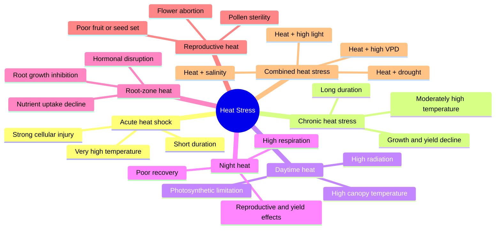

---

# 3. Animated-Style Heat Stress Concept

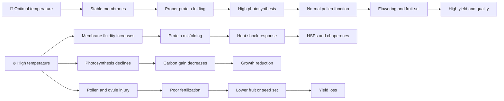

---

# 4. Heat Stress Thresholds

There is no universal heat-stress temperature for all plants. Heat stress begins when tissue temperature exceeds the crop’s optimal range.

| Crop/process | Approximate sensitivity |
|---|---|
| Leaf expansion | Sensitive to prolonged moderate heat |
| Photosynthesis | Often declines before visible injury |
| Membrane stability | Declines under severe or prolonged heat |
| Pollen development | Highly sensitive, often one of the weakest points |
| Fruit set | Strongly affected by heat during flowering |
| Seed filling | Reduced by high temperature shortening duration |
| Root growth | Sensitive to high root-zone temperature |
| Fruit quality | Can be altered by heat during ripening |

## Important distinction

```text
Air temperature ≠ Leaf temperature ≠ Canopy temperature ≠ Root-zone temperature
```

A plant may experience high leaf temperature even when air temperature is moderate if transpiration cooling is limited. Conversely, a well-watered canopy may remain cooler than air temperature because of transpiration.

---

# 5. Core Heat Stress Framework

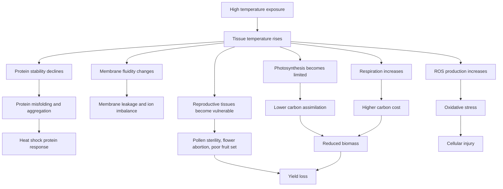

---

# 6. Major Heat Stress Mechanisms

Heat stress tolerance is not a single trait. It is an integrated outcome of multiple mechanisms.

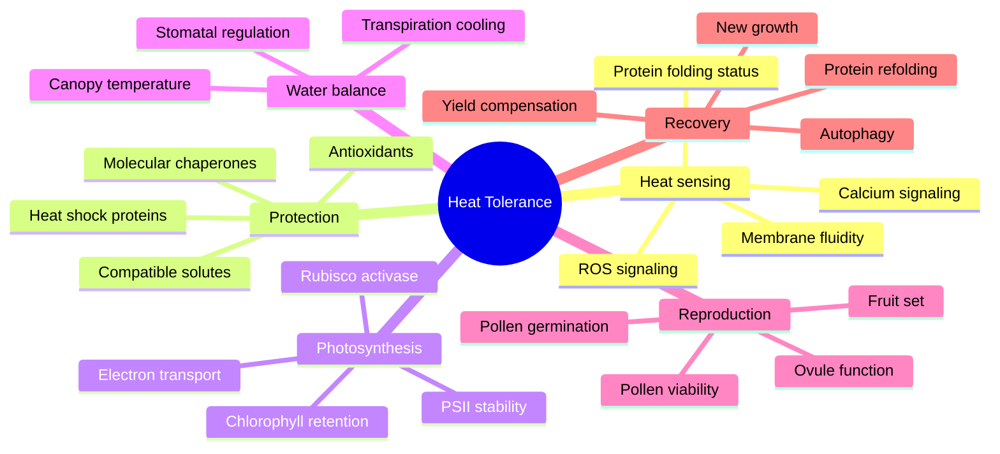

---

# 7. Mechanism 1: Membrane Fluidity and Thermal Sensing

## Why membranes matter

Cellular membranes are among the earliest structures affected by heat. High temperature increases membrane fluidity, which can disturb permeability, ion gradients, protein function, and signaling.

## Mechanistic sequence

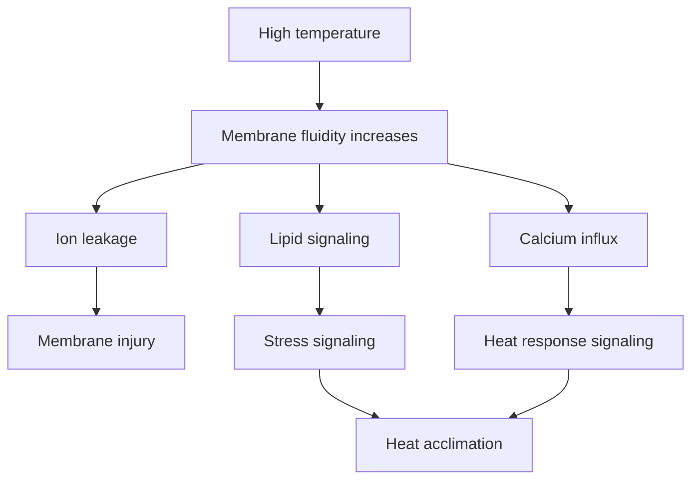

## Consequences

- Increased electrolyte leakage
- Reduced membrane integrity
- Altered ion transport
- Altered enzyme activity
- Chloroplast and mitochondrial membrane disruption
- Activation of heat signaling pathways

## Key traits

| Trait | Interpretation |
|---|---|
| Electrolyte leakage | Membrane injury |
| Membrane stability index | Heat tolerance indicator |
| MDA | Lipid peroxidation |
| Survival percentage | Severe heat injury outcome |
| Leaf injury score | Visible thermal damage |
| Fv/Fm | Heat impact on photosystem stability |

---

# 8. Mechanism 2: Protein Misfolding, HSPs, and Molecular Chaperones

High temperature can denature proteins or cause misfolding and aggregation. Plants respond by activating heat shock transcription factors and heat shock proteins.

## Heat shock response model

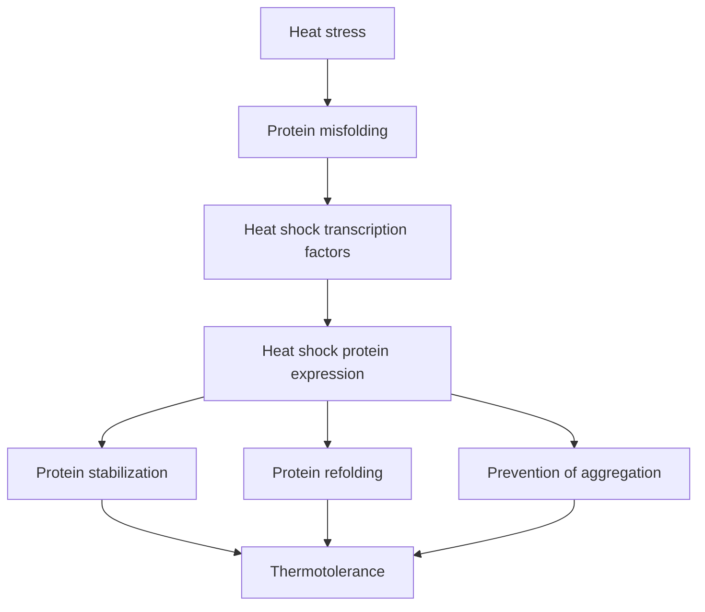

## Major heat shock protein groups

| HSP class | General function |
|---|---|
| Small HSPs | Prevent irreversible protein aggregation |
| HSP60 | Protein folding in organelles |
| HSP70 | Protein folding, refolding, import, repair |
| HSP90 | Stabilization of regulatory proteins |
| HSP100/ClpB | Protein disaggregation and thermotolerance |
| Co-chaperones | Regulate chaperone specificity and activity |

## Interpretation

High HSP expression can indicate active protection, but it may also indicate severe heat damage. HSP data should be interpreted with membrane stability, photosynthesis, survival, growth, and yield.

---

# 9. Mechanism 3: Photosynthetic Limitation Under Heat

Photosynthesis is one of the most heat-sensitive physiological processes.

## Major heat-sensitive components

- Photosystem II
- Thylakoid membrane integrity
- Electron transport
- Rubisco activase
- Rubisco carboxylation capacity
- Chlorophyll content
- Mesophyll conductance
- Stomatal conductance
- Sink demand

## Photosynthesis heat-stress model

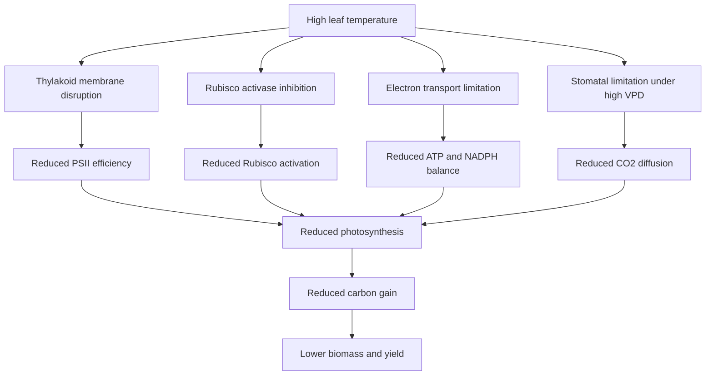

## Key traits

| Trait | Interpretation |
|---|---|
| Net photosynthesis | Carbon assimilation |
| Stomatal conductance | Cooling and CO2 diffusion |
| Transpiration | Evaporative cooling |
| Ci | Balance between stomatal and biochemical limitation |
| Fv/Fm | Maximum PSII efficiency |
| ΦPSII | Operating PSII efficiency |
| ETR | Electron transport |
| NPQ | Heat dissipation |
| Chlorophyll | Pigment stability |
| A/Ci curve | Rubisco and electron transport limitation |

---

# 10. Mechanism 4: Respiration and Carbon Balance

Heat increases respiration, especially at night. When respiration increases and photosynthesis declines, net carbon gain is reduced.

## Carbon balance model

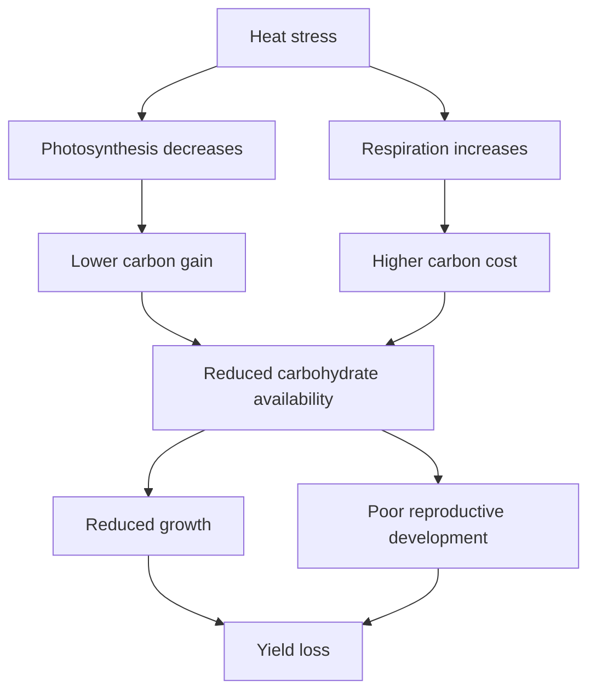

## Why night heat matters

High night temperature can be damaging because:

- Respiration remains elevated.
- Carbohydrate reserves are consumed.
- Recovery from daytime heat is reduced.
- Reproductive development can be disrupted.
- Grain or fruit filling may be shortened.

## Traits

- Day photosynthesis
- Night respiration
- Leaf carbohydrate concentration
- Sucrose/starch concentration
- Biomass accumulation
- Fruit or seed filling rate
- Yield components

---

# 11. Mechanism 5: Transpiration Cooling and Canopy Temperature

Plants can cool leaves through transpiration. This makes water status and stomatal function central to heat tolerance.

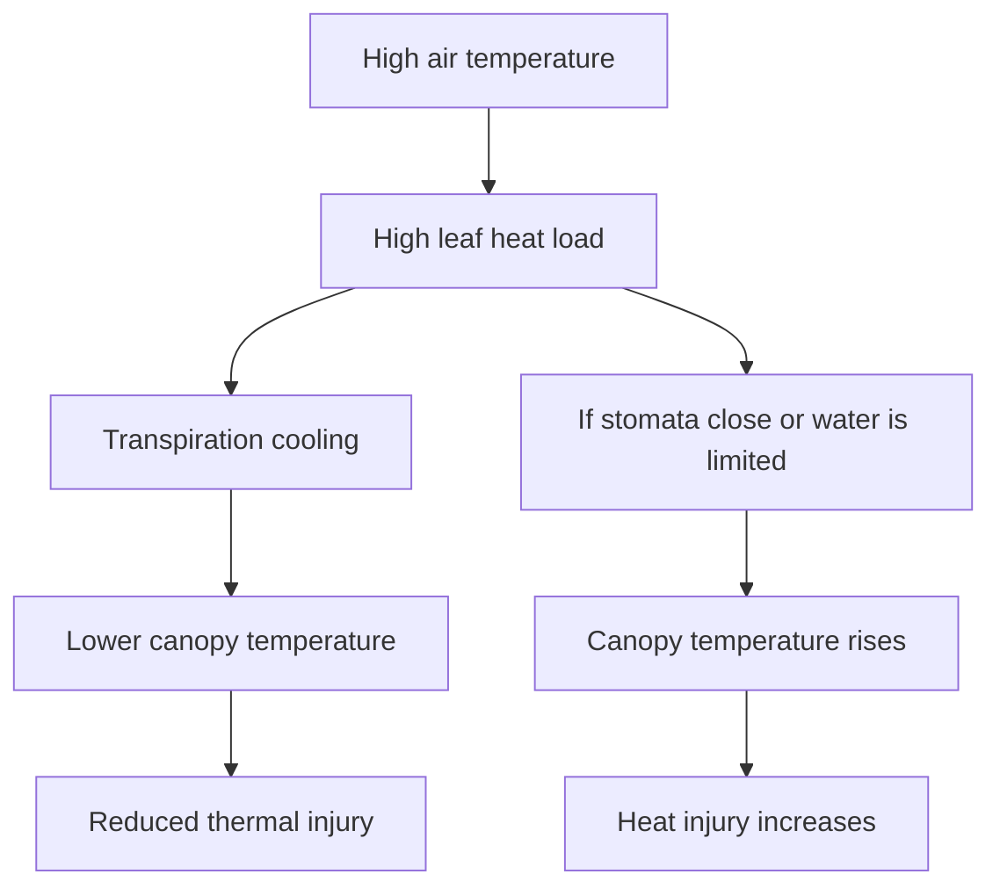

## Important concept

A plant may be heat tolerant because it avoids high tissue temperature through canopy cooling, not because its cells are inherently thermotolerant.

## Key traits

| Trait | Interpretation |
|---|---|
| Canopy temperature | Integrated heat and water status |
| Canopy temperature depression | Cooling capacity |
| Stomatal conductance | Cooling and gas exchange |
| Transpiration | Evaporative cooling |
| Leaf water potential | Ability to sustain cooling |
| Soil moisture | Water supply for cooling |
| Thermal images | Spatial heat response |

---

# 12. Mechanism 6: ROS and Oxidative Stress

Heat stress disrupts photosynthesis, respiration, and membrane function, causing ROS accumulation.

## ROS model

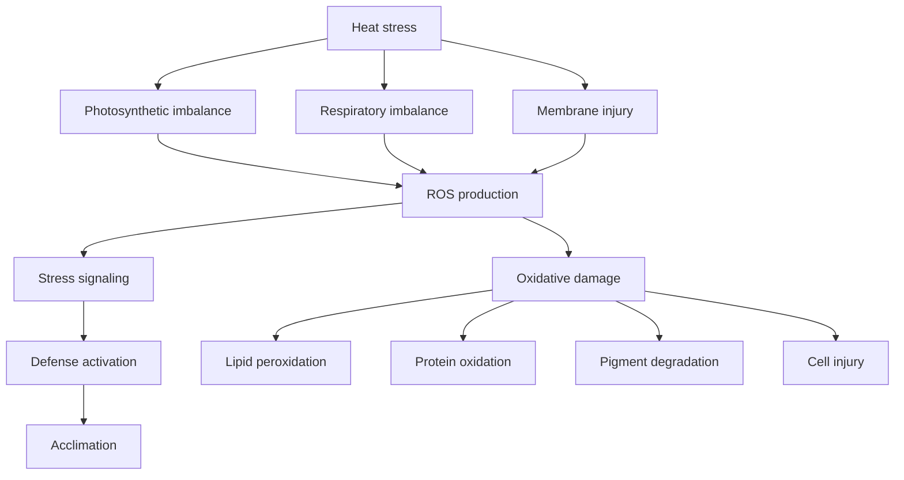

## Antioxidant defense components

| Component | Function |
|---|---|
| SOD | Converts superoxide radicals |
| CAT | Detoxifies hydrogen peroxide |
| APX | Ascorbate-dependent peroxide detoxification |
| GR | Glutathione cycle maintenance |
| Ascorbate | Non-enzymatic antioxidant |
| Glutathione | Redox buffer |
| Carotenoids | Photoprotection |
| Tocopherols | Lipid protection |
| Phenolics | Antioxidant protection |

## Traits

- MDA
- Electrolyte leakage
- H2O2
- SOD
- CAT
- APX
- GR
- Total antioxidant capacity
- Chlorophyll fluorescence
- Leaf injury score

---

# 13. Mechanism 7: Hormonal Regulation Under Heat

Heat response involves extensive hormonal crosstalk.

| Hormone | Heat-stress role |
|---|---|
| ABA | Stomatal regulation, water conservation, stress signaling |
| Ethylene | Senescence, flower/fruit abortion, stress signaling |
| JA | Defense and stress response |
| SA | Heat acclimation and ROS-related defense |
| Auxin | Growth redistribution and thermomorphogenesis |
| Cytokinin | Senescence delay and source-sink balance |
| Gibberellin | Growth regulation and heat-related elongation |
| Brassinosteroids | Stress tolerance and antioxidant regulation |
| Strigolactones | Root and shoot response, stress adaptation |

## Hormone interaction model

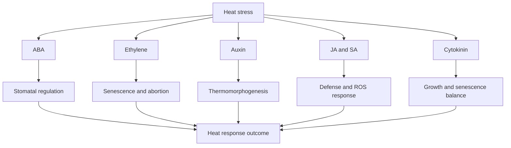

---

# 14. Mechanism 8: Thermomorphogenesis

Thermomorphogenesis refers to growth and developmental changes caused by warm temperatures.

## Common responses

- Hypocotyl elongation
- Petiole elongation
- Leaf hyponasty
- Altered leaf angle
- Reduced leaf thickness
- Accelerated flowering in some species
- Altered root growth
- Modified canopy architecture

## Why it matters

Thermomorphogenesis can help avoid heat by improving leaf cooling or changing architecture, but it may also reduce compactness, yield, or marketability in horticultural crops.

## Traits

- Petiole length
- Internode length
- Leaf angle
- Leaf area
- Canopy architecture
- Flowering time
- Biomass allocation

---

# 15. Mechanism 9: Root-Zone Heat Stress

Roots are often ignored in heat-stress studies, but high root-zone temperature can strongly limit plant performance.

## Root-zone heat affects:

- Root elongation
- Root branching
- Root respiration
- Water uptake
- Nutrient uptake
- Hormonal signaling
- Rhizosphere biology
- Shoot growth
- Fruit set and yield

## Root-zone heat model

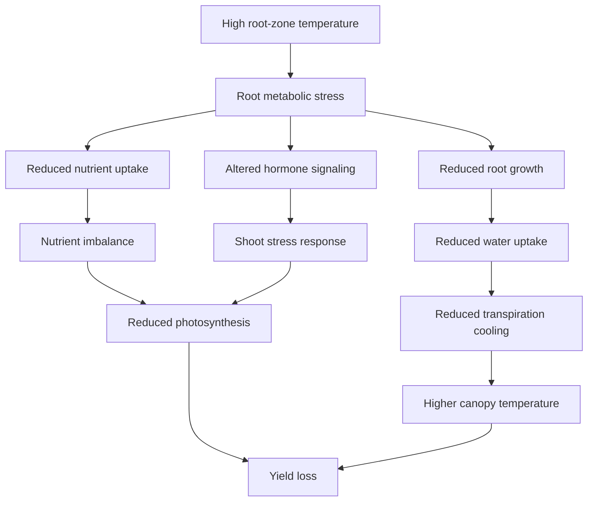

## Traits

- Root length
- Root surface area
- Root dry weight
- Root respiration
- Root electrolyte leakage
- Root-zone temperature
- Tissue nutrient concentration
- Water uptake
- Shoot biomass
- Yield

---

# 16. Mechanism 10: Reproductive Heat Stress

Reproductive development is often the most heat-sensitive part of the crop life cycle.

## Sensitive processes

- Floral initiation
- Anther development
- Tapetum function
- Pollen meiosis
- Pollen maturation
- Pollen viability
- Pollen germination
- Pollen tube growth
- Stigma receptivity
- Ovule function
- Fertilization
- Embryo development
- Fruit set
- Seed set
- Grain filling

## Reproductive heat model

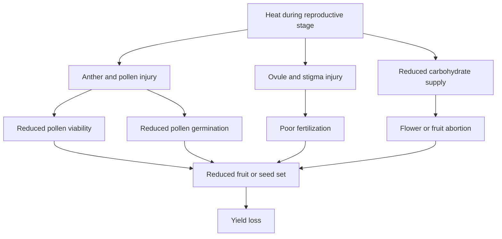

## Important traits

| Trait | Interpretation |
|---|---|
| Pollen viability | Male fertility under heat |
| Pollen germination | Functional pollen performance |
| Pollen tube growth | Fertilization potential |
| Flower retention | Reproductive stability |
| Fruit set | Fertilization and early sink success |
| Seed set | Reproductive success |
| Grain number | Heat effect on sink number |
| Average fruit weight | Sink filling response |
| Marketable yield | Practical outcome |

---

# 17. Mechanism 11: Source-Sink Disruption

Heat can reduce source strength and sink development simultaneously.

## Source effects

- Reduced photosynthesis
- Reduced leaf longevity
- Increased respiration
- Reduced carbohydrate accumulation

## Sink effects

- Poor pollen function
- Reduced fruit set
- Reduced seed set
- Shortened grain filling
- Reduced fruit enlargement
- Poor quality

## Source-sink model

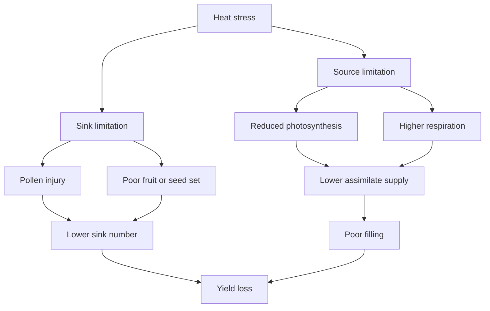

---

# 18. Mechanism 12: Heat Acclimation, Priming, and Memory

Plants may become more heat tolerant after exposure to mild heat before severe heat.

## Concepts

| Concept | Meaning |
|---|---|
| Basal thermotolerance | Ability to survive sudden heat |
| Acquired thermotolerance | Improved tolerance after mild heat priming |
| Heat priming | Pre-exposure to moderate heat |
| Heat memory | Longer-lasting preparedness after prior heat |
| Recovery | Restoration of function after heat stress |

## Heat priming model

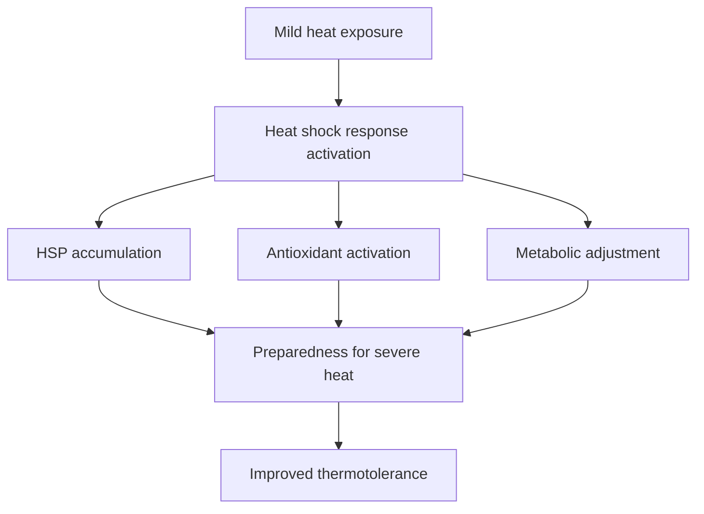

## Traits

- Survival after severe heat
- HSP expression
- Fv/Fm recovery
- Electrolyte leakage recovery
- Photosynthetic recovery
- New leaf growth
- Fruit set after heat wave
- Yield recovery

---

# 19. Heat Stress Symptoms

## Early symptoms

- Leaf rolling
- Wilting under high VPD
- Higher canopy temperature
- Reduced stomatal conductance
- Reduced photosynthesis
- Reduced pollen viability
- Flower drop

## Moderate symptoms

- Leaf chlorosis
- Leaf scorch
- Accelerated senescence
- Reduced growth
- Poor fruit set
- Smaller fruits or seeds

## Severe symptoms

- Necrosis
- Membrane leakage
- Tissue collapse
- Complete pollen sterility
- Fruit abortion
- Plant death

---

# 20. Measurement Framework

## 20.1 Stress intensity

| Measurement | Importance |
|---|---|
| Air temperature | Environmental heat exposure |
| Leaf temperature | Actual tissue heat load |
| Canopy temperature | Integrated heat and water status |
| Root-zone temperature | Belowground heat stress |
| VPD | Atmospheric demand |
| Radiation | Heat load and light stress |
| Relative humidity | Evaporative cooling potential |
| Stress duration | Determines damage severity |
| Day/night temperature | Separates daytime and night heat effects |

## 20.2 Physiological response

| Trait | Importance |
|---|---|
| Photosynthesis | Carbon assimilation |
| Stomatal conductance | Cooling and CO2 diffusion |
| Transpiration | Evaporative cooling |
| Chlorophyll fluorescence | PSII heat sensitivity |
| Chlorophyll content | Pigment stability |
| Canopy temperature | Heat avoidance |
| Electrolyte leakage | Membrane injury |
| MDA | Lipid peroxidation |

## 20.3 Reproductive response

| Trait | Importance |
|---|---|
| Flower number | Reproductive potential |
| Flower abortion | Heat injury |
| Pollen viability | Male fertility |
| Pollen germination | Functional pollen ability |
| Pollen tube growth | Fertilization potential |
| Fruit set | Reproductive success |
| Seed set | Fertility outcome |
| Fruit or grain weight | Sink filling |
| Marketable yield | Practical outcome |

---

# 21. Recommended Trait Sets

## Minimum trait set

| Category | Traits |
|---|---|
| Stress intensity | Air temperature, canopy temperature |
| Growth | Plant height, biomass |
| Physiology | Chlorophyll, stomatal conductance |
| Injury | Visual heat injury |
| Outcome | Yield or survival |

## Strong publishable trait set

| Category | Traits |
|---|---|
| Microclimate | Air temperature, RH, VPD, radiation |
| Thermal response | Leaf/canopy temperature |
| Gas exchange | A, gsw, E, Ci |
| Fluorescence | Fv/Fm, ΦPSII, ETR, NPQ |
| Membrane injury | Electrolyte leakage, MDA |
| Reproduction | Pollen viability, fruit set |
| Performance | Biomass, yield, quality |

## Advanced mechanistic trait set

| Category | Traits |
|---|---|
| Protein protection | HSP expression, HSF expression |
| ROS defense | SOD, CAT, APX, GR, antioxidants |
| Metabolism | Sugars, starch, proline, amino acids |
| Hormones | ABA, ethylene, SA, JA, cytokinins |
| Root response | Root temperature, root growth, root respiration |
| Reproduction | Tapetum integrity, pollen tube growth, ovule viability |
| Imaging | Thermal, fluorescence imaging, hyperspectral |
| Omics | Transcriptomics, proteomics, metabolomics |

---

# 22. Heat Stress Indices

## Percent reduction

```text
Percent reduction = ((Control - Heat) / Control) × 100
```

## Relative performance

```text
Relative performance = Heat treatment value / Control value
```

## Heat tolerance index

```text
Heat tolerance index = Yield under heat / Yield under control
```

## Membrane stability index

```text
Membrane stability index = 1 - (Electrolyte leakage under heat / Maximum electrolyte leakage)
```

## Pollen fertility retention

```text
Pollen fertility retention = Pollen viability under heat / Pollen viability under control
```

## Canopy cooling capacity

```text
Canopy cooling capacity = Air temperature - Canopy temperature
```

## Photosynthetic heat stability

```text
Photosynthetic heat stability = Photosynthesis under heat / Photosynthesis under control
```

---

# 23. Experimental Design Considerations

## Important design decisions

| Decision | Why it matters |
|---|---|
| Heat intensity | Determines mild, moderate, severe response |
| Stress duration | Short heat shock differs from chronic heat |
| Growth stage | Seedling, vegetative, flowering, and fruiting differ |
| Day vs night heat | Affects photosynthesis vs respiration |
| Root-zone temperature | Separates root and shoot heat effects |
| Water status | Heat and drought are often confounded |
| VPD control | High VPD can mimic or intensify heat stress |
| Recovery period | Shows resilience |
| Pollen sampling time | Reproductive response is stage-specific |
| Replication | Heat chambers often have position effects |

## Heat treatment examples

| Treatment type | Example use |
|---|---|
| Acute heat shock | Cellular thermotolerance |
| Chronic moderate heat | Crop productivity |
| Daytime heat | Photosynthesis and canopy temperature |
| Night heat | Respiration and reproductive response |
| Flowering-stage heat | Pollen and fruit set |
| Root-zone heat | Root physiology |
| Heat + drought | Realistic field stress combination |

---

# 24. Crop-Specific Interpretation

## Strawberry

Likely heat responses:

- Reduced photosynthesis
- Reduced flower retention
- Poor fruit set
- Smaller fruit
- Softer fruit
- Reduced marketable yield
- Lower fruit quality under severe heat

Important traits:

- Leaf gas exchange
- Canopy temperature
- Flower number
- Fruit set
- Fruit size
- Marketable yield
- Firmness
- Soluble solids
- Anthocyanins

---

## Tomato

Likely heat responses:

- Pollen sterility
- Flower drop
- Poor fruit set
- Smaller fruits
- Blossom-end rot risk under water/Ca imbalance
- Reduced lycopene accumulation under extreme heat

Important traits:

- Pollen viability
- Pollen germination
- Flower retention
- Fruit set
- Fruit weight
- Marketable yield
- TSS
- Lycopene
- Canopy temperature

---

## Lettuce

Likely heat responses:

- Bolting
- Tipburn risk
- Bitter flavor
- Reduced head quality
- Reduced fresh weight
- Leaf scorch under severe heat

Important traits:

- Fresh weight
- Bolting percentage
- Leaf temperature
- Chlorophyll
- Tipburn incidence
- Marketable quality

---

## Watermelon

Likely heat responses:

- Reduced vine growth under severe stress
- Poor pollen performance
- Reduced fruit set
- Smaller fruit
- Altered fruit quality
- Strong rootstock effects possible

Important traits:

- Vine length
- Canopy temperature
- Pollen viability
- Fruit set
- Fruit weight
- Marketable yield
- Brix
- Firmness

---

## Corn

Likely heat responses:

- Reduced pollen viability
- Poor silk-pollen synchrony under combined stress
- Reduced kernel set
- Shortened grain filling
- Lower grain weight

Important traits:

- Anthesis-silking interval
- Pollen viability
- Silk emergence
- Kernel number
- Canopy temperature
- Photosynthesis
- Grain yield

---

## Soybean

Likely heat responses:

- Flower abortion
- Pod abortion
- Reduced seed number
- Reduced seed weight
- Altered protein and oil composition
- Reduced photosynthesis

Important traits:

- Flower retention
- Pod set
- Seed number
- Seed weight
- Photosynthesis
- Canopy temperature
- Protein
- Oil

---

# 25. Visual Infographics to Create

Create original figures and upload them later.

| Infographic | Suggested file name |
|---|---|
| Healthy vs heat-stressed plant | `assets/photos/healthy-vs-heat-stressed-plant.jpg` |
| Heat stress mechanism overview | `assets/infographics/heat-stress-mechanism-overview.png` |
| Heat shock protein response | `assets/infographics/heat-hsp-response.png` |
| Photosynthesis under heat | `assets/infographics/heat-photosynthesis-limitation.png` |
| Pollen and fruit set under heat | `assets/infographics/heat-reproductive-stress.png` |
| Canopy cooling and VPD | `assets/infographics/heat-canopy-cooling-vpd.png` |
| Heat trait selection matrix | `assets/infographics/heat-trait-selection-matrix.png` |

## Image placeholder

```html
<p align="center">
  
</p>

<p align="center">
  <b>Figure 1.</b> Original conceptual model linking high temperature, membrane instability, protein misfolding, photosynthetic limitation, reproductive failure, and yield loss.
</p>
```

---

# 26. Data Analysis Strategy

## Basic analysis

- Treatment means
- Percent reduction
- Heat tolerance index
- ANOVA or mixed model
- Post-hoc mean separation

## Intermediate analysis

- Genotype × heat interaction
- Heat × growth stage interaction
- Regression of yield against canopy temperature
- Regression of fruit set against pollen viability
- Correlation of Fv/Fm, electrolyte leakage, and yield
- PCA for multi-trait heat tolerance

## Advanced analysis

- Repeated-measures mixed models
- Thermal time analysis
- Day vs night heat comparison
- Canopy temperature depression analysis
- Stress recovery modeling
- Structural equation modeling
- Trait-yield network analysis
- Multivariate heat tolerance ranking
- Omics-integrated heat response analysis

---

# 27. Interpretation Workflow

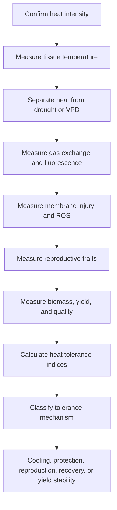

---

# 28. Common Mistakes in Heat Stress Research

## Mistake 1: Reporting only air temperature

Leaf and canopy temperature may differ from air temperature. Tissue temperature is often more biologically meaningful.

## Mistake 2: Ignoring VPD

High VPD can reduce stomatal conductance and increase canopy temperature. Heat and atmospheric drought must be separated when possible.

## Mistake 3: Ignoring reproductive stage

Vegetative heat tolerance does not guarantee reproductive heat tolerance.

## Mistake 4: Measuring only survival

Survival is not enough for crop heat tolerance. Yield and quality must be measured.

## Mistake 5: Ignoring night temperature

High night temperature can increase respiration and reduce carbon balance.

## Mistake 6: Assuming high HSP expression always means tolerance

HSPs can indicate protection, but also stress severity. Interpret with physiology and yield.

## Mistake 7: Ignoring water supply

Heat tolerance may depend on transpiration cooling, which depends on water availability.

---

# 29. Research-Quality Checklist

## Stress setup

- Report air temperature.
- Report leaf or canopy temperature.
- Report relative humidity.
- Report VPD.
- Report radiation or light intensity.
- Report root-zone temperature if relevant.
- Define stress duration.
- Define growth stage at stress.
- Include recovery period if relevant.

## Physiology

- Measure gas exchange if possible.
- Include chlorophyll fluorescence.
- Include canopy temperature.
- Include membrane stability.
- Include visual injury.

## Reproduction

- Measure flowering stage.
- Measure pollen viability.
- Measure pollen germination if possible.
- Measure fruit or seed set.
- Measure final yield.

## Interpretation

- Separate heat injury from drought injury.
- Connect physiology to reproduction.
- Connect reproduction to yield.
- Interpret tissue temperature, not only air temperature.
- Report limitations clearly.

---

# 30. Key References to Build Around

## Foundational heat stress physiology

- Wahid, A., Gelani, S., Ashraf, M., & Foolad, M. R. Heat tolerance in plants: an overview. *Environmental and Experimental Botany*.
- Bita, C. E., & Gerats, T. Plant tolerance to high temperature in a changing environment: scientific fundamentals and production of heat stress-tolerant crops. *Frontiers in Plant Science*.
- Kotak, S., Larkindale, J., Lee, U., von Koskull-Döring, P., Vierling, E., & Scharf, K. D. Complexity of the heat stress response in plants. *Current Opinion in Plant Biology*.
- Hasanuzzaman, M., Nahar, K., Alam, M. M., et al. Physiological, biochemical, and molecular mechanisms of heat stress tolerance in plants. *International Journal of Molecular Sciences*.

## Reproductive heat stress

- Giorno, F., Wolters-Arts, M., Mariani, C., & Rieu, I. Ensuring reproduction at high temperatures: the heat stress response during anther and pollen development. *Plants*.
- Zinn, K. E., Tunc-Ozdemir, M., & Harper, J. F. Temperature stress and plant sexual reproduction: uncovering the weakest links. *Journal of Experimental Botany*.
- De Storme, N., & Geelen, D. The impact of environmental stress on male reproductive development in plants. *Plant Physiology*.

## Photosynthesis and heat

- Sharkey, T. D. Effects of moderate heat stress on photosynthesis. *Photosynthesis Research*.
- Crafts-Brandner, S. J., & Salvucci, M. E. Sensitivity of photosynthesis in a C4 plant, maize, to heat stress. *Plant Physiology*.
- Salvucci, M. E., & Crafts-Brandner, S. J. Inhibition of photosynthesis by heat stress: the activation state of Rubisco as a limiting factor.

## ROS and antioxidant defense

- Mittler, R. Oxidative stress, antioxidants, and stress tolerance. *Trends in Plant Science*.
- Gill, S. S., & Tuteja, N. Reactive oxygen species and antioxidant machinery in abiotic stress tolerance. *Plant Physiology and Biochemistry*.
- Miller, G., Suzuki, N., Ciftci-Yilmaz, S., & Mittler, R. Reactive oxygen species homeostasis and signaling during drought and salinity stresses. *Plant, Cell & Environment*.

## Books

- Taiz, L., Zeiger, E., Møller, I. M., & Murphy, A. *Plant Physiology and Development*.
- Lambers, H., Chapin, F. S., & Pons, T. L. *Plant Physiological Ecology*.
- Larcher, W. *Physiological Plant Ecology*.

---

# 31. Public GitHub Note

Use:

- Original writing
- Original Mermaid diagrams
- Your own photos
- Open-license images with attribution
- Figures you create yourself
- Published or simulated datasets only

Avoid:

- Copyrighted textbook figures
- Screenshots from books
- Copied journal figures unless clearly open-license
- Large copied text from papers or books
- Unpublished collaborator data without permission

---

# End of advanced heat stress physiology guide
