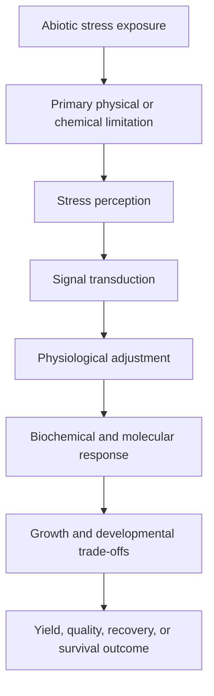
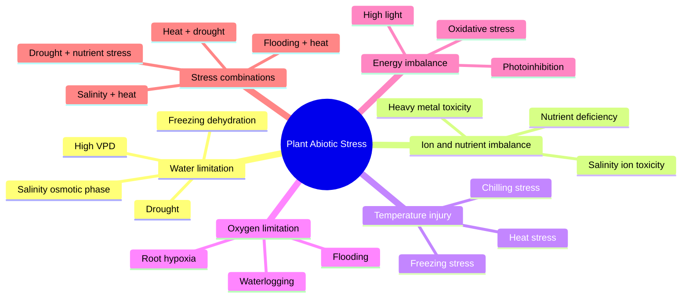
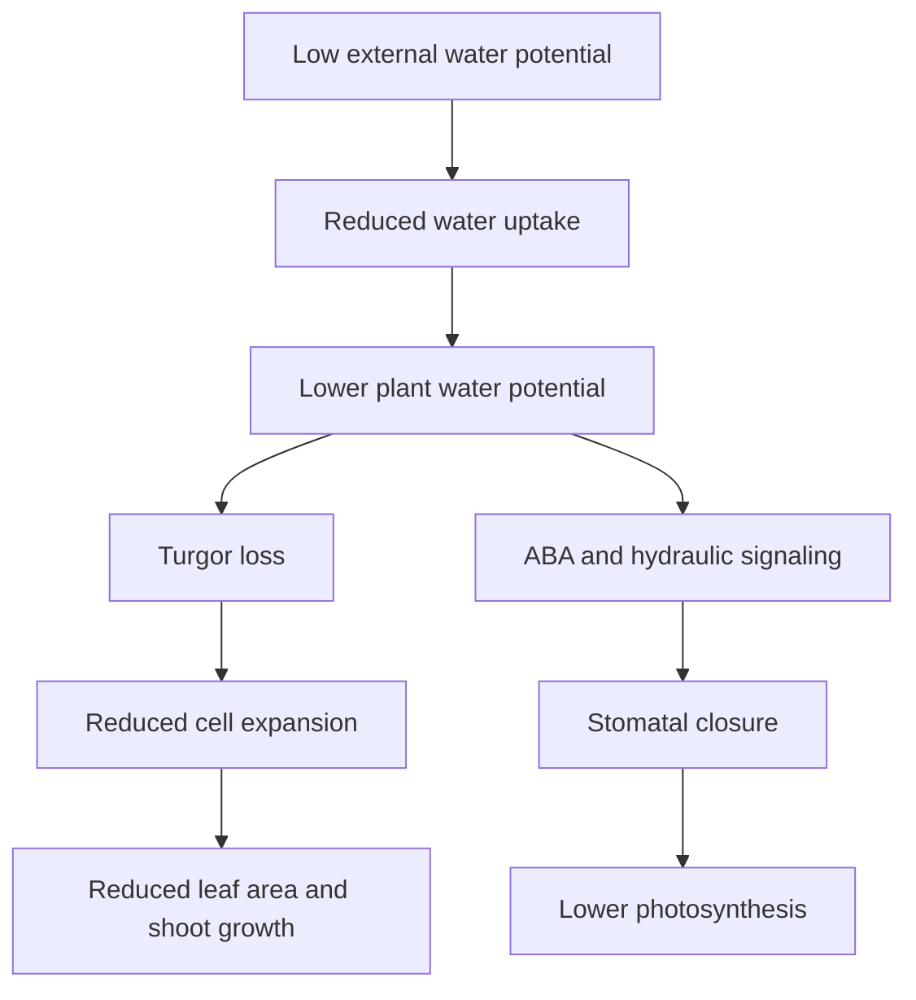
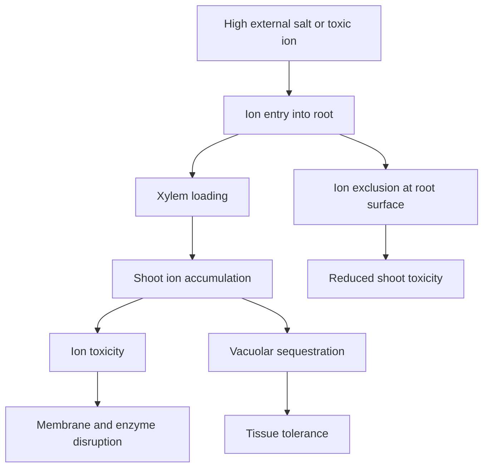
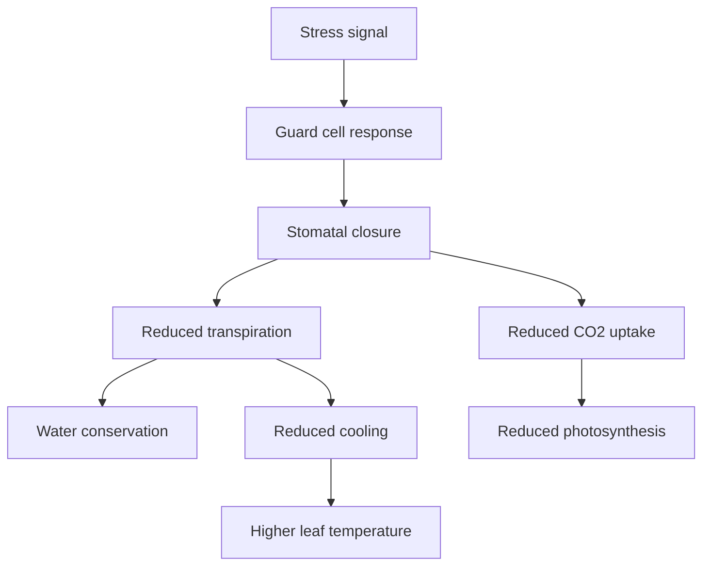
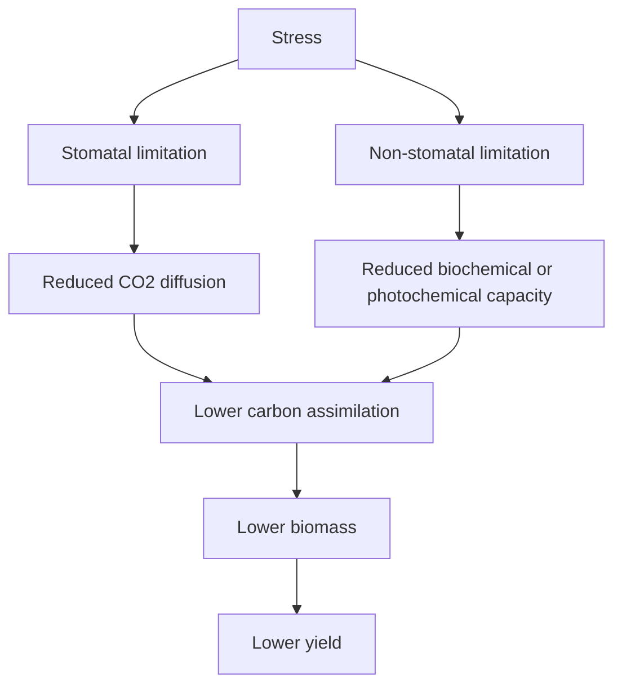
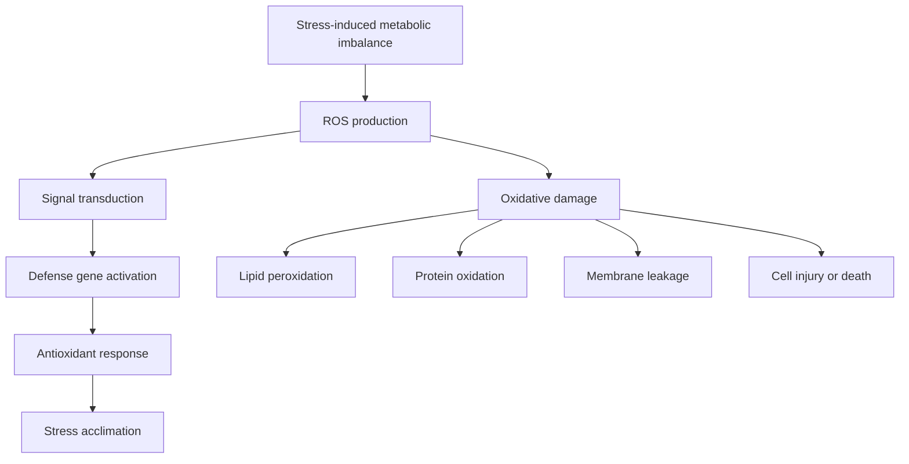
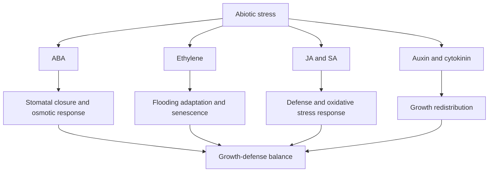
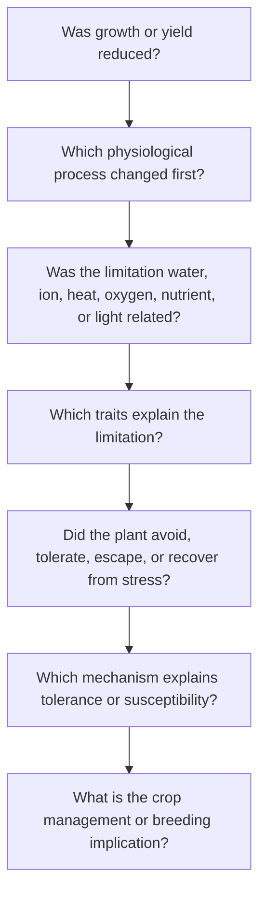

# Abiotic Stress Mechanism Index

## Purpose

This file is the central index for the **Plant Stress Physiology Knowledge Hub**. It organizes major abiotic stresses by their primary limitation, physiological mechanism, measurable traits, research interpretation, and visual workflow.

This index is not organized by textbook chapters. It is organized by **stress type and biological mechanism**, which is more useful for research, experiment planning, data interpretation, manuscript writing, and scientific presentation.

---

# 1. How to Use This Repository

Use this repository as a research information center for:

- Designing abiotic stress physiology experiments
- Selecting traits for stress screening
- Understanding mechanisms of tolerance and susceptibility
- Connecting physiology with biomass, yield, quality, and recovery
- Developing manuscript introductions and discussion sections
- Preparing conference presentations and extension-style summaries
- Building reproducible data-analysis and interpretation workflows

---

# 2. General Abiotic Stress Framework

Abiotic stress occurs when a non-living environmental factor limits plant growth, development, reproduction, metabolism, yield, quality, or survival.

Common abiotic stresses include:

- Drought stress
- Salinity stress
- Heat stress
- Chilling and freezing stress
- Flooding and waterlogging stress
- Light and oxidative stress
- Nutrient stress
- Heavy metal stress
- Ozone and ultraviolet stress
- Combined abiotic stress

---

# 3. Universal Stress Response Model

Most abiotic stress responses can be interpreted using the following framework:



## Interpretation

A strong stress physiology interpretation should connect:

- What stress was applied
- How intense the stress was
- How long the stress lasted
- Which crop stage was affected
- Which physiological process was limited first
- Which traits responded early
- Which traits predicted final growth or yield
- Whether the plant recovered after stress removal
- Whether tolerance was caused by avoidance, tolerance, escape, or recovery

---

# 4. Core Concept Map



---

# 5. Major Stressors and Primary Limitations

| Stress type | Primary limitation | First affected process | Major outcome |
|---|---|---|---|
| Drought | Low water availability | Turgor and stomatal conductance | Reduced growth, photosynthesis, and yield |
| Salinity | Osmotic stress and ion toxicity | Water uptake and ion homeostasis | Chlorosis, reduced biomass, ion injury |
| Heat | High temperature injury | Membrane stability, proteins, reproduction | Pollen injury, poor fruit/seed set, yield loss |
| Chilling/freezing | Low temperature injury | Membrane fluidity and photosynthetic balance | Seedling injury, photoinhibition, survival loss |
| Flooding/waterlogging | Root-zone oxygen deficiency | Root respiration and ATP production | Root injury, nutrient uptake decline, chlorosis |
| High light/oxidative stress | Excess excitation energy | Photosystem stability and ROS balance | Photoinhibition and oxidative damage |
| Nutrient stress | Deficiency, excess, or imbalance | Metabolism and growth | Chlorosis, poor biomass, yield and quality loss |
| Heavy metal stress | Toxic ion accumulation | Root growth and enzyme function | Root inhibition, ROS, membrane damage |
| Ozone/UV stress | Oxidative and photooxidative injury | Leaf tissues and photosystems | Foliar injury, reduced photosynthesis |
| Combined stress | Multiple interacting limitations | Depends on stress combination | Non-additive response and complex yield loss |

---

# 6. Major Mechanistic Categories

## 6.1 Water-status disruption

Water-status disruption is central to drought, salinity, freezing, heat under high vapor pressure deficit, and many combined stresses.

Important mechanisms:

- Reduced soil water potential
- Reduced root water uptake
- Reduced leaf water potential
- Loss of turgor pressure
- Stomatal closure
- Reduced transpiration
- Increased canopy temperature
- Reduced cell expansion
- Reduced nutrient mass flow
- Reduced photosynthetic carbon assimilation

Important traits:

- Soil water content
- Relative water content
- Leaf water potential
- Stomatal conductance
- Transpiration
- Canopy temperature
- Root traits
- Biomass
- Yield

---

## 6.2 Osmotic stress

Osmotic stress occurs when the external water potential becomes too low for easy water uptake.

Important in:

- Drought
- Salinity
- Freezing-related dehydration
- High fertilizer salt concentration
- Poor root-zone water availability

Mechanistic sequence:



Traits:

- Osmotic potential
- Relative water content
- Leaf water potential
- Stomatal conductance
- Proline
- Soluble sugars
- Biomass retention
- Recovery after rewatering

---

## 6.3 Ion toxicity and ion homeostasis

Ion toxicity is especially important under salinity and heavy metal stress.

Important mechanisms:

- Na+ accumulation
- Cl- accumulation
- K+ displacement
- Ca2+ imbalance
- Enzyme inhibition
- Membrane destabilization
- Vacuolar sequestration
- Ion exclusion
- Ion retrieval from xylem
- Chelation and compartmentalization

Visual summary:



Traits:

- Root-zone EC
- Shoot Na+
- Root Na+
- Shoot K+
- K+/Na+ ratio
- Cl- concentration
- Ca2+ concentration
- Electrolyte leakage
- Leaf burn score
- Biomass and yield

---

## 6.4 Stomatal regulation

Stomata regulate the trade-off between carbon gain and water loss.

Important in:

- Drought
- Salinity
- Heat
- High VPD
- Ozone stress
- Combined heat + drought

Mechanism:



Traits:

- Stomatal conductance
- Transpiration
- Photosynthesis
- Intrinsic water-use efficiency
- Intercellular CO2 concentration
- Leaf temperature
- Canopy temperature

Interpretation caution:

Strong stomatal closure may protect water status, but it can also reduce photosynthesis, biomass, and yield. It should be interpreted with final performance traits.

---

## 6.5 Photosynthetic limitation

Stress can reduce photosynthesis through stomatal and non-stomatal limitations.

Stomatal limitation:

- Lower stomatal conductance
- Reduced CO2 diffusion
- Lower intercellular CO2
- Lower carbon fixation

Non-stomatal limitation:

- Reduced Rubisco activity
- Reduced Rubisco activase function
- Impaired electron transport
- Chlorophyll loss
- Photoinhibition
- Reduced mesophyll conductance
- Sink limitation
- Accelerated senescence

Visual summary:



Traits:

- A or Pn
- gsw
- E
- Ci
- A/Ci curve
- Fv/Fm
- ΦPSII
- ETR
- NPQ
- Chlorophyll
- NDVI
- NDRE
- Biomass
- Yield

---

## 6.6 Reactive oxygen species and oxidative stress

Reactive oxygen species are both signaling molecules and damaging molecules.

Important ROS sources:

- Chloroplasts
- Mitochondria
- Peroxisomes
- Plasma membrane NADPH oxidases
- Apoplast

ROS can increase under:

- Drought
- Salinity
- Heat
- Chilling
- Freezing
- High light
- Flooding and reoxygenation
- Heavy metals
- Ozone
- UV radiation

Visual summary:



Traits:

- MDA
- Electrolyte leakage
- Hydrogen peroxide
- Superoxide
- SOD activity
- CAT activity
- APX activity
- GR activity
- Ascorbate
- Glutathione
- Total antioxidant capacity
- Leaf injury score

Interpretation caution:

Higher antioxidant enzyme activity may indicate better defense, but it may also indicate more severe stress. Always interpret antioxidant traits with injury, growth, and yield data.

---

## 6.7 Membrane stability

Membrane stability is a key stress-tolerance trait under heat, chilling, freezing, salinity, drought, and heavy metal stress.

Mechanisms:

- Heat increases membrane fluidity
- Chilling decreases membrane fluidity
- Freezing causes dehydration and membrane disruption
- Salinity alters ion balance and membrane integrity
- ROS oxidize membrane lipids
- Heavy metals destabilize membrane proteins and lipids

Traits:

- Electrolyte leakage
- MDA
- Membrane stability index
- Survival percentage
- Fv/Fm
- Leaf injury score

---

## 6.8 Hormonal regulation

Hormonal crosstalk determines whether the plant prioritizes survival, defense, growth, reproduction, or recovery.

| Hormone | Major stress-related role |
|---|---|
| ABA | Drought, salinity, stomatal closure, osmotic stress |
| Ethylene | Flooding, senescence, adventitious roots, aerenchyma |
| JA | Defense, wounding, stress crosstalk |
| SA | Oxidative stress, defense signaling |
| Auxin | Root architecture, growth redistribution |
| Cytokinin | Senescence, shoot growth, source-sink balance |
| Gibberellin | Growth regulation, submergence response |
| Brassinosteroids | Stress tolerance and antioxidant regulation |
| Strigolactones | Root architecture and drought-related rhizosphere signaling |

Visual summary:



---

# 7. Stress-Specific Overview

## 7.1 Drought stress

Primary limitation:

- Low water availability
- Reduced plant water potential
- Turgor loss
- Stomatal closure

Main mechanisms:

- ABA signaling
- Hydraulic signaling
- Osmotic adjustment
- Root architecture adjustment
- Photosynthetic limitation
- ROS production
- Recovery after rewatering

Best early traits:

- Soil moisture
- Leaf water potential
- Relative water content
- Stomatal conductance
- Canopy temperature

Best final traits:

- Biomass
- Yield
- Root traits
- Recovery percentage
- Yield stability

Detailed file:

```text
stress-types/01-drought-stress.md
```

---

## 7.2 Salinity stress

Primary limitation:

- Osmotic stress
- Na+ and Cl- toxicity
- K+/Na+ imbalance

Main mechanisms:

- Osmotic phase
- Ionic phase
- Na+ exclusion
- K+ retention
- Vacuolar sequestration
- SOS-type ion homeostasis
- Oxidative stress defense

Best early traits:

- Root-zone EC
- Chlorophyll
- Stomatal conductance
- Leaf injury score

Best final traits:

- Shoot Na+
- Shoot K+
- K+/Na+ ratio
- Biomass
- Yield

Detailed file:

```text
stress-types/02-salinity-stress.md
```

---

## 7.3 Heat stress

Primary limitation:

- Excess temperature
- Membrane destabilization
- Protein denaturation
- Photosynthetic limitation
- Reproductive failure

Main mechanisms:

- Heat shock protein response
- Membrane thermostability
- Rubisco activase sensitivity
- Respiration increase
- Pollen viability loss
- Flower and fruit set disruption

Best early traits:

- Canopy temperature
- Fv/Fm
- Electrolyte leakage
- Photosynthesis

Best final traits:

- Pollen viability
- Fruit set
- Seed set
- Marketable yield

Detailed file:

```text
stress-types/03-heat-stress.md
```

---

## 7.4 Flooding and waterlogging stress

Primary limitation:

- Root-zone oxygen deficiency
- Reduced aerobic respiration
- Low ATP production
- Root injury

Main mechanisms:

- Hypoxia
- Anoxia
- Anaerobic metabolism
- Ethylene accumulation
- Adventitious root formation
- Aerenchyma development
- Post-flood recovery or oxidative injury

Best early traits:

- Soil oxygen
- Soil redox potential
- Root health score
- Chlorophyll
- Stomatal conductance

Best final traits:

- Survival
- Adventitious root traits
- Biomass
- Yield
- Recovery after drainage

Detailed file:

```text
stress-types/04-flooding-waterlogging-stress.md
```

---

## 7.5 Chilling and freezing stress

Primary limitation:

- Low temperature injury
- Membrane rigidification
- Photosynthetic imbalance
- Freezing dehydration

Main mechanisms:

- Cold acclimation
- Membrane lipid adjustment
- Photoinhibition
- Compatible solute accumulation
- Extracellular ice-related dehydration

Best early traits:

- Germination
- Emergence
- Fv/Fm
- Electrolyte leakage
- Chlorophyll

Best final traits:

- Seedling vigor
- Survival
- Biomass
- Recovery

Detailed file:

```text
stress-types/05-chilling-freezing-stress.md
```

---

## 7.6 Light and oxidative stress

Primary limitation:

- Excess excitation energy
- ROS accumulation
- Photoinhibition

Main mechanisms:

- PSII damage
- D1 repair cycle
- Non-photochemical quenching
- Xanthophyll cycle
- Antioxidant defense
- Pigment protection

Best early traits:

- Fv/Fm
- ΦPSII
- NPQ
- ETR
- Chlorophyll fluorescence imaging

Best final traits:

- Leaf injury
- Photosynthesis
- Biomass
- Pigment retention

Detailed file:

```text
stress-types/06-light-oxidative-stress.md
```

---

## 7.7 Nutrient stress

Primary limitation:

- Deficiency
- Toxicity
- Nutrient imbalance
- Impaired metabolism

Main mechanisms:

- Reduced enzyme function
- Reduced chlorophyll synthesis
- Impaired photosynthesis
- Altered root architecture
- Nutrient remobilization
- Source-sink imbalance

Best early traits:

- Tissue nutrient concentration
- Petiole sap nutrients
- Chlorophyll
- NDVI
- NDRE

Best final traits:

- Biomass
- Yield
- Fruit quality
- Nutrient-use efficiency

Detailed file:

```text
stress-types/07-nutrient-stress.md
```

---

## 7.8 Heavy metal stress

Primary limitation:

- Toxic ion accumulation
- Root inhibition
- Oxidative stress
- Enzyme inhibition

Main mechanisms:

- Root exclusion
- Chelation
- Vacuolar sequestration
- Antioxidant defense
- Nutrient competition
- Membrane damage

Best early traits:

- Root length
- Root biomass
- Chlorophyll
- Electrolyte leakage
- MDA

Best final traits:

- Metal concentration
- Biomass
- Survival
- Yield penalty

Detailed file:

```text
stress-types/08-heavy-metal-stress.md
```

---

## 7.9 Combined abiotic stress

Primary limitation:

- Multiple simultaneous stress limitations
- Non-additive physiological response
- Hormonal crosstalk
- ROS convergence

Common combinations:

- Heat + drought
- Heat + salinity
- Drought + nutrient stress
- Flooding + heat
- Chilling + flooding
- High light + drought

Best early traits:

- Photosynthesis
- Stomatal conductance
- Canopy temperature
- Fv/Fm
- Pigments
- Hormones

Best final traits:

- Biomass
- Yield
- Quality
- Recovery
- Stability index

Detailed file:

```text
stress-types/09-combined-abiotic-stress.md
```

---

# 8. Trait Selection Guide

## Minimum trait set

Use this when time, labor, or instruments are limited:

| Category | Traits |
|---|---|
| Growth | Plant height, leaf number, biomass |
| Physiology | Chlorophyll, stomatal conductance |
| Stress intensity | Soil moisture, EC, temperature, oxygen, depending on stress |
| Final outcome | Yield or survival |

## Strong trait set

Use this for publishable stress physiology studies:

| Category | Traits |
|---|---|
| Water status | Leaf water potential, relative water content |
| Gas exchange | Photosynthesis, stomatal conductance, transpiration, Ci |
| Fluorescence | Fv/Fm, ΦPSII, ETR, NPQ |
| Pigments | Chlorophyll, anthocyanins, flavonols |
| Roots | Root length, volume, biomass, root/shoot ratio |
| Injury | Electrolyte leakage, MDA, injury score |
| Performance | Biomass, yield, quality |

## Advanced trait set

Use this for mechanistic studies:

| Category | Traits |
|---|---|
| Hormones | ABA, SA, JA, IAA, cytokinins, ethylene-related traits |
| Biochemistry | Proline, sugars, antioxidants, MDA |
| Nutrients | Tissue N, P, K, Ca, Mg, micronutrients |
| Spectral traits | NDVI, NDRE, CIgreen, CIred-edge, TCARI, VARI |
| Root physiology | Hydraulic conductance, root respiration, aerenchyma |
| Reproduction | Pollen viability, fruit set, seed set |
| Data analysis | PCA, mixed models, stress indices, trait-yield correlation |

---

# 9. Instrumentation Guide

| Instrument/tool | Best use |
|---|---|
| LI-COR 6800 | Gas exchange, photosynthesis, A/Ci curves, fluorescence |
| LI-COR 600 | Rapid stomatal conductance and fluorescence screening |
| MPM-100 | Chlorophyll, flavonols, anthocyanins, nitrogen balance index |
| Chlorophyll fluorometer | PSII function and photoinhibition |
| Pressure chamber | Leaf or stem water potential |
| Thermal camera | Canopy temperature and water stress |
| Multispectral sensor | NDVI, NDRE, canopy stress detection |
| Root scanner | Root architecture |
| ICP-OES/ICP-MS | Tissue nutrients and ion toxicity |
| EC meter | Salinity intensity |
| Soil oxygen/redox sensor | Flooding and waterlogging intensity |
| Conductivity meter | Electrolyte leakage and membrane injury |
| Spectrophotometer | Biochemical stress markers |

---

# 10. Research Interpretation Logic

A stress physiology study should avoid describing only whether a treatment was statistically significant. The stronger goal is to explain **why** the plant responded.

Use this logic:



---

# 11. Tolerance Interpretation Framework

## Stress avoidance

The plant avoids internal stress exposure.

Examples:

- Deeper roots under drought
- Reduced transpiration
- Na+ exclusion under salinity
- Canopy cooling under heat
- Adventitious roots under flooding

## Stress tolerance

The plant maintains function despite internal stress.

Examples:

- Osmotic adjustment
- Membrane stability
- Antioxidant defense
- Tissue ion tolerance
- Photosystem protection
- Cold acclimation

## Stress escape

The plant completes sensitive stages before severe stress occurs.

Examples:

- Early flowering
- Short growth duration
- Rapid grain filling
- Early fruit maturity

## Stress recovery

The plant resumes function after stress removal.

Examples:

- Photosynthetic recovery
- Root regrowth
- New leaf growth
- Reproductive compensation
- Biomass recovery

---

# 12. Visual Assets to Add Later

Add your own images to these folders:

```text
assets/photos/
assets/figures/
assets/infographics/
assets/original-diagrams/
```

Recommended visuals:

| Stress | Photos to add | Infographics to create |
|---|---|---|
| Drought | Wilting, leaf rolling, dry soil, canopy temperature | Soil-water-root-shoot pathway |
| Salinity | Leaf burn, salt crust, chlorosis | Osmotic phase vs ionic phase |
| Heat | Flower abortion, pollen injury, leaf scorch | Heat stress and reproductive failure |
| Flooding | Saturated soil, root browning, adventitious roots | Hypoxia to ethylene response |
| Chilling/freezing | Seedling injury, necrosis | Cold acclimation pathway |
| Oxidative/light | Sunscald, photobleaching | Excess light to ROS |
| Nutrient stress | Deficiency symptoms | Nutrient deficiency diagnosis |
| Heavy metal | Root inhibition | Metal uptake and sequestration |
| Combined stress | Multiple stress symptoms | Stress crosstalk network |

Example image syntax:

```markdown

```

Example centered image with caption:

```markdown
<p align="center">
  
</p>

<p align="center">
  <b>Figure.</b> Conceptual summary of drought stress effects on water status, stomatal regulation, photosynthesis, and yield.
</p>
```

---

# 13. Key Literature Themes to Add Later

This repository should eventually include references on:

- Drought physiology and water relations
- Photosynthesis under drought and salinity
- Stomatal regulation and ABA signaling
- Root architecture and drought avoidance
- Salinity tolerance and ion homeostasis
- Heat shock proteins and reproductive heat stress
- Flooding, hypoxia, ethylene, and aerenchyma
- Cold acclimation and freezing tolerance
- ROS signaling and antioxidant defense
- Nutrient stress and nutrient-use efficiency
- Heavy metal toxicity and sequestration
- Combined abiotic stress and stress crosstalk
- High-throughput phenotyping and spectral indices
- Trait-yield relationships and stress tolerance indices

---

# 14. Core References to Expand

Add full formatted references later in `references/literature-database.md`.

Suggested starting references:

- Chaves, M. M., Maroco, J. P., & Pereira, J. S. Understanding plant responses to drought: from genes to the whole plant.
- Chaves, M. M., Flexas, J., & Pinheiro, C. Photosynthesis under drought and salt stress: regulation mechanisms from whole plant to cell.
- Flexas, J., & Medrano, H. Drought-inhibition of photosynthesis in C3 plants: stomatal and non-stomatal limitations revisited.
- Tardieu, F., Simonneau, T., & Muller, B. The physiological basis of drought tolerance in crop plants.
- Munns, R., & Tester, M. Mechanisms of salinity tolerance.
- Zhu, J. K. Salt and drought stress signal transduction in plants.
- Wahid, A., Gelani, S., Ashraf, M., & Foolad, M. R. Heat tolerance in plants: an overview.
- Bita, C. E., & Gerats, T. Plant tolerance to high temperature in a changing environment.
- Bailey-Serres, J., & Voesenek, L. A. C. J. Flooding stress: acclimations and genetic diversity.
- Mittler, R. Abiotic stress, the field environment and stress combination.
- Suzuki, N., Rivero, R. M., Shulaev, V., Blumwald, E., & Mittler, R. Abiotic and biotic stress combinations.
- Gill, S. S., & Tuteja, N. Reactive oxygen species and antioxidant machinery in abiotic stress tolerance.

---

# 15. Public Repository Use

This repository should include:

- Original summaries
- Original diagrams
- Original infographics
- Your own photos
- Open-license photos with attribution
- Publicly available references
- Simulated or published datasets
- Research interpretation frameworks

Avoid uploading:

- Copyrighted textbook figures
- Screenshots from books
- Copied journal figures unless the license allows reuse
- Unpublished collaborator data without permission
- Large copied passages from books or papers
- Private lab datasets without approval

---

# End of stress mechanism index
